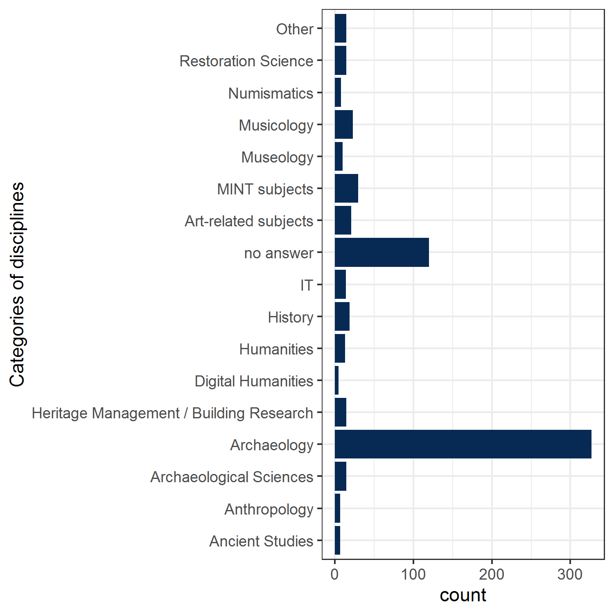

<!-- This is the format for text comments that will be ignored during renderings. Do not put R code in these comments because it will not be ignored. -->
<!-- With the following code you can access and display values from the yml header above. -->

Keywords:

Highlights:

<!-- The following code chunk defines some general settings how code chunks should behave. -->

Datengrundlage
==============

Daten als csv bekommen und IPs etc entfernt. Insgesamt über 600
Antworten, dabei aber viele, die sich “nur durchgeklickt” haben oder nur
Teile der Umfrage ausgefüllt haben (teilweise um die 70%).

Demographische Angaben
======================

Alter und Beschäftigungsverhältnis
----------------------------------

Zuerst einige allgemeine Statistiken zu der Teilnehmergruppe:

 Wir haben knapp 50 20-29jährige,
der Großteil der befragten ist zwischen 30 udn 60 Jahre alt und arbeitet
an einer Hochschule, in der Forschung, im Museum oder in einer
Denkmalbehörde (man beachte die über 80jährige Person, die nicht mehr
arbeitet…). Seltener kommen Grabungsfirmen und Archive vor.

Alter und Gruppe
----------------

Innerhalb der Altersstufen teilen sich die Menschen auf folgende Gruppen
auf:

 Das Gros besteht aus
wissenschaftlichen Mitarbeiterinnen an der Hochschule und in
Forschungseinrichtungen.

Alter und Erfahrung + Wichtung
==============================

Gibt es einen Zusammenhang zwischen dem Alter der Teilnehmenden Person,
der Erfahrung die sie in digitalen Forschungsdatenmanagement hat und dem
Gewicht, dass sie dem sie ihm zuweist?

 Alle Altersgruppen haben sehr
gemischt Erfahrungen und Wissensstände mit digitalem Datenmanagement.
Bei den Senioren (70-79) lassen sich zwei Gruppen differenzieren (viel
Ahnung - wenig Ahnung), sie halten digitales Forschungsdatenmanagement
allgemein für weniger wichtig für ihre tägliche Arbeit.

Jüngere Teilnehmende schätzen ihre eigene Erfahrung deutlich geringer
ein als diejenigen “die im Beruf stehen” und zwischen 30 und 60 Jahre
alt sind. Diese Gruppe scheint dem digitalen FDM auch den höchsten
Stellenwert in ihrer täglichen Arbeit zuzuweisen.

Wer viel von Forschungsdatenmanagement hält, scheint sich häufig schon
recht gut weitergebildet zu haben (oder anders herum: Einschätzung der
Wichtigkeit kommt von eigener Erfahrung!). Nur wenige Personen geben an,
ihre Erfahrung als mittig einzuschätzen, wenn sie FDM für wichtig halten
und die gelben Punkte (sehr hoher Stellenwert des digitalen FDM für die
eigene Arbeit) häufen sich im Bereich "viel Erfahrung).

Diese Ergebnisse sollten statistische getestet werden:

### Test: Alter - Erfahrung mit spearmans rho

Für den Test werden die Teilnehmer entfernt, die keine Altersangabe
gemacht haben.

Es bleiben für den Vergleich 850 Teilnehmer.

    #> 
    #>  Spearman's rank correlation rho
    #> 
    #> data:  age_group2$beginn and age_group2$erfahrung_digfdm
    #> S = 99630634, p-value = 0.2743
    #> alternative hypothesis: true rho is not equal to 0
    #> sample estimates:
    #>         rho 
    #> -0.03794608

Nach der Berechnung des Tests lässt sich keine signifikante Korrelation
zwischen Alter und Erfahrung feststellen, somit besteht kein linearer
Zusammenhang zwischen Alter und Erfahrung mit digitalem FDM. Dies
überrascht nicht, da die älteren Kolleg\*innen vmtl weniger Kontakt
bisher damit hatten.

Aus diesem Grund wird die Vermutung eines linearen Zusammenhangs
aufgegeben und nur ein Vergleich der verschiedenen Gruppen (kategorial)
geführt:

### Test: Alter - Erfahrung mit chi²

Der Chi-Quadrat-Test darf eigentlich für diese Daten nicht angewendet
werden, da die Erwartungswerte zu gering werden (Anzahl der Teilnehmer
muss auf zu viele Subgruppen aufgeteilt werden). Anhang der Residuen
lassen sich trotzdem Erkenntnisse erarbeiten:

    #>               age_group[, 7]
    #> age_group[, 1]           0           1           2           3           4
    #>          20-29  3.78037151  0.71632797  0.71618591 -0.55873770  0.51366887
    #>          30-39 -1.43572821 -2.03436124 -0.92463709 -0.41778759 -2.11440429
    #>          40-49 -0.98551875 -0.21634759  0.99269261  0.03204506  0.77354509
    #>          50-59  0.92900386  1.10154466 -1.31194466 -0.68883014  1.21180188
    #>          60-69 -0.32686023  1.95685903  1.07641703  1.63596430  0.51084486
    #>          70-79 -0.39223227 -0.41602515  2.05497797  2.42438082 -0.66506217
    #>               age_group[, 7]
    #> age_group[, 1]           5           6           7           8           9
    #>          20-29  1.83449846 -0.81322300 -0.09464900 -1.40801899 -1.51197903
    #>          30-39  0.23609608  0.08759594  1.80625803  1.65101601 -1.09917878
    #>          40-49 -1.89930415  2.33560712 -1.56846874 -0.39036707  1.59411609
    #>          50-59  0.53624892 -1.64944305 -0.41881213 -0.04001503  0.65351728
    #>          60-69  0.57781270 -0.25292394  0.01669451 -1.08407273 -0.96210240
    #>          70-79 -1.10940039 -0.92507796 -0.28380674 -0.53218116  1.87356783
    #>               age_group[, 7]
    #> age_group[, 1]          10
    #>          20-29 -0.60235670
    #>          30-39  0.02208477
    #>          40-49  0.35484035
    #>          50-59  0.94291664
    #>          60-69 -1.47838058
    #>          70-79 -0.77831178

die größten Abweichungen gibt es bei der Altersgruppe der 20-29jährigen
im Bereich “Erfahrung = 0”, dort sind sie überrepräsentiert, ebenso wie
die Altersgruppen 60-69 und 70-70 im Bereich der niedrigen
Erfahrungswerte 1-3 überrepräsentiert sind.

    #> [1] 0.1557093

Cramers V ergibt einen Wert von 0,16, was auf einen schwachen
Zusammenhang zwischen Altersgruppe und Erfahrung schließen lässt.

–\> Conclusio: Ältere und junge haben wenig Erfahrung. Das ist nicht
allzu überraschend.

Als nächstes kann die Gewichtung für die eigene Arbeit untersucht
werden:

### Test: Alter - Wichtung mit spearmans rho

    #> 
    #>  Spearman's rank correlation rho
    #> 
    #> data:  rank(age_group[, 1]) and age_group[, 8]
    #> S = 111667326, p-value = 2.176e-06
    #> alternative hypothesis: true rho is not equal to 0
    #> sample estimates:
    #>        rho 
    #> -0.1633436

Je älter, desto weniger wichtig. Schwacher, aber höchstsignifikanter
Zusammenhang.

### Test: Alter - Wichtung mit Chi²

Wie oben kann auch hier nur mit den Residualwerten gearbeitet werden.

    #>               age_group[, 8]
    #> age_group[, 1]           0           1           2           3           4
    #>          20-29 -0.25943726 -0.63548891 -0.24657867  1.01551156 -0.91420749
    #>          30-39 -0.57596074  0.71562822 -1.31559957 -1.14357421  0.59543767
    #>          40-49 -0.49759035 -0.39839187  1.98053478 -0.47826645 -0.30596170
    #>          50-59  1.46460302  0.36765411 -0.40124627 -0.16968540 -1.07119833
    #>          60-69 -0.29417420 -0.72057669  0.27745145  1.24860606  1.63430113
    #>          70-79 -0.09805807 -0.24019223 -0.42742521  3.58892527  1.11132477
    #>               age_group[, 8]
    #> age_group[, 1]           5           6           7           8           9
    #>          20-29  1.06090576 -0.19917412  0.29738600 -3.38657493  0.67666495
    #>          30-39 -2.56256150 -1.37171824 -0.92235505  0.73669310  2.72490066
    #>          40-49  0.16873391 -0.39215848  0.29282650  0.81607905 -1.23128762
    #>          50-59  1.83349695  0.87542636 -0.29005027 -0.02587174 -1.05574893
    #>          60-69 -0.00858377  2.24653579  1.55781939  0.18768111 -1.67093471
    #>          70-79  1.93134826 -0.69337525 -0.02843889  0.06256037 -1.07417231
    #>               age_group[, 8]
    #> age_group[, 1]          10
    #>          20-29  2.33460911
    #>          30-39  0.35915555
    #>          40-49 -0.17194282
    #>          50-59  0.09886962
    #>          60-69 -2.16694124
    #>          70-79 -1.42437571

Auffällig ist hier die Altersgruppe der 20-29jährigen, die dem digitalen
FDM eine höhere Bedeutung zuweist als erwartet. Ältere Semester tun das
wenig überraschender weise gegenteilig.

    #> [1] 0.1553697

Anhand Cramers V \~ 0,16 lässt sich wieder ein schwacher Zusammenhang
zwischen Alter und Gewichtung festhalten.

Korreliert die Einschätzung der Wichtigkeit und die Erfahrung und lassen sich darin Gruppen unterscheiden?
----------------------------------------------------------------------------------------------------------

Für diese Frage werden die beiden Werte Einschätzung der Wichtigkeit für
das eigene Arbeiten und die eigene Erfahrung gegeneinander plotten. Da
in beiden Fällen keine stetigen metrischen Werte vorliegen, sondern nur
mit diskreten Werten gearbeitet wurde, muss für die Visualisierung ein
“jitter-Effekt” eingesetzt werden, der die Punkte ein wenig verschiebt,
damit nicht alle direkt übereinander liegen.

Allgemein kann der Zusammenhang bestätigt werden (eingezeichnet blaue
Linie ist lineare Regression mit Konfidenzintervall). Verschiedene
Einfärbungen werden nun getestet:

### Gruppenzugehörigkeit

 m. E. lässt sich kein
Zusammenhang zwischen der Zugehörigkeit zu einer Gruppe und der Wichtung
/ Erfahrung im digitalen FDM finden.

Auffällig ist der/die einsame Studierende oben links in der Ecke,
der/die die Bedeutung von FDM sehr hoch einschätzt, aber selber
überhaupt keine Erfahrung hat. Kann dieser Person jemand bitte ganz
schnell einen Datenbankenkurs anbieten?

Der Bereich “hat selber wenig Erfahrung, schätzt aber die Bedeutung für
die eigene Arbeit hoch ein” (also Einschätzung Bedeutung FDM 6-10 und
Einschätzung eigene Erfahrung FDM 0-4) ist eine Zielgruppe für uns: Das
sind die Personen, die wissen, dass sie sich fortbilden müssen, denen
aber evtl einfach das Angebot fehlt. Es sind darin alle Gruppen
vertreten, außer Daten- und IT-Beautragte.

### Blickwinkel der Antwortenden

 Institutionen und Individuen
zeigen keine Musterungen.

### Einrichtungen

 Eventuell zeigen sich
Grabungsfirmen insbesondere in dem höherschätzenden Bereich. Es zeigt
sich bei allen Einrichtungen eine große Heterogenität.

### Teststatistiken zu dem Zusammenhang eigenes Wissen und Bedeutung

    #> 
    #> Call:
    #> lm(formula = erfahrung_digfdm ~ stellenwert_digfdm, data = erfahrung_group)
    #> 
    #> Residuals:
    #>     Min      1Q  Median      3Q     Max 
    #> -7.7089 -1.4109  0.2381  1.5626  7.4831 
    #> 
    #> Coefficients:
    #>                    Estimate Std. Error t value Pr(>|t|)    
    #> (Intercept)         1.21895    0.24708   4.934 9.72e-07 ***
    #> stellenwert_digfdm  0.64900    0.03105  20.900  < 2e-16 ***
    #> ---
    #> Signif. codes:  0 '***' 0.001 '**' 0.01 '*' 0.05 '.' 0.1 ' ' 1
    #> 
    #> Residual standard error: 1.989 on 849 degrees of freedom
    #>   (18 observations deleted due to missingness)
    #> Multiple R-squared:  0.3397, Adjusted R-squared:  0.3389 
    #> F-statistic: 436.8 on 1 and 849 DF,  p-value: < 2.2e-16

R² \~ 0,34: moderater Zusammenhang zwischen eigener Erfahrung und dem
Stellenwert der dem digitalen FDM zugeschrieben wird.

### Gibt es eine Trennung zwischen Menschen mit viel und wenig Ahnung?

Hier ist es sinnvoll, sich einfach die Verteilung anzuschauen. Ist sie
normalverteilt? 

Die Erfahrung mit digitalem Datenmanagement in unserer Umfrage ist
nicht-normalverteilt, sondern nach rechts verschoben:

-   Median = 6
-   Mittelwert = 6.0018484
-   Modus = 8

Hier kann sich zeigen, dass wir vor allem Leute erreicht haben, die sich
mit dem Thema schon beschäftigt haben. Es gibt einen deutlichen Anstieg
zwischen der Einschätzung “4” und “5”. Hier lassen sich eventuell zwei
Gruppen unterscheiden.

Welche Arbeitgeber haben ein Richtlinienkatalog?
================================================

<table class="table table-striped table-hover" style="margin-left: auto; margin-right: auto;">
<thead>
<tr>
<th style="text-align:left;">
</th>
<th style="text-align:right;">
ja
</th>
<th style="text-align:right;">
nein
</th>
<th style="text-align:right;">
weiß nicht
</th>
</tr>
</thead>
<tbody>
<tr>
<td style="text-align:left;">
Archiv
</td>
<td style="text-align:right;">
4
</td>
<td style="text-align:right;">
1
</td>
<td style="text-align:right;">
2
</td>
</tr>
<tr>
<td style="text-align:left;">
Außeruniversitäre Forschungseinrichtung
</td>
<td style="text-align:right;">
66
</td>
<td style="text-align:right;">
36
</td>
<td style="text-align:right;">
24
</td>
</tr>
<tr>
<td style="text-align:left;">
Denkmalbehörde
</td>
<td style="text-align:right;">
24
</td>
<td style="text-align:right;">
23
</td>
<td style="text-align:right;">
18
</td>
</tr>
<tr>
<td style="text-align:left;">
Forschungsverbund
</td>
<td style="text-align:right;">
3
</td>
<td style="text-align:right;">
5
</td>
<td style="text-align:right;">
2
</td>
</tr>
<tr>
<td style="text-align:left;">
Grabungsfirma
</td>
<td style="text-align:right;">
15
</td>
<td style="text-align:right;">
1
</td>
<td style="text-align:right;">
1
</td>
</tr>
<tr>
<td style="text-align:left;">
keiner
</td>
<td style="text-align:right;">
1
</td>
<td style="text-align:right;">
3
</td>
<td style="text-align:right;">
10
</td>
</tr>
<tr>
<td style="text-align:left;">
Museum
</td>
<td style="text-align:right;">
24
</td>
<td style="text-align:right;">
67
</td>
<td style="text-align:right;">
32
</td>
</tr>
<tr>
<td style="text-align:left;">
Sonstiges
</td>
<td style="text-align:right;">
7
</td>
<td style="text-align:right;">
7
</td>
<td style="text-align:right;">
12
</td>
</tr>
<tr>
<td style="text-align:left;">
Universität/Hochschule
</td>
<td style="text-align:right;">
60
</td>
<td style="text-align:right;">
53
</td>
<td style="text-align:right;">
55
</td>
</tr>
</tbody>
</table>

Für die Analyse, ob es hier nennenswerte Unterschiede gibt, entfernen
wir die Angaben “weiß nicht”:

    #>                                          
    #>                                                     ja         nein
    #>   Archiv                                   0.908025222 -0.926371019
    #>   Außeruniversitäre Forschungseinrichtung  1.938304471 -1.977466093
    #>   Denkmalbehörde                           0.006127555 -0.006251357
    #>   Forschungsverbund                       -0.534679673  0.545482374
    #>   Grabungsfirma                            2.394478944 -2.442857143
    #>   keiner                                  -0.728145644  0.742857143
    #>   Museum                                  -3.289546822  3.356009027
    #>   Sonstiges                               -0.052393683  0.053452248
    #>   Universität/Hochschule                   0.312193629 -0.318501208

Chi nur eingeschränkt nutzbar, weil die Voraussetzungen nicht 100%
erfüllt. Grabungsfirmen und außeruniversitäre Forschungseinrichrungen
haben häufiger einen Richtlinienkatalog als zu erwarten währen, während
insbesondere Museen keine haben.

Analyse der Software, die für Projektmanagement genutzt wird
============================================================

Häufigkeit der genannten Anbieter und ob dies freie oder proprietäre
Software ist:

Analyse Software, die für Forschungsdatenanalyse genutzt wird
-------------------------------------------------------------

1.  Datenvorbereitung

<!-- -->

    #>                  word freq
    #> excel           excel  238
    #> qgis             qgis  120
    #> access         access   39
    #> keine           keine   22
    #> word             word   17
    #> spss             spss   17
    #> arcgis         arcgis   16
    #> filemaker   filemaker   15
    #> python         python   14
    #> office         office   10
    #> past             past   10
    #> autocad       autocad    8
    #> software     software    7
    #> open             open    7
    #> calc             calc    6
    #> libre           libre    6
    #> gephi           gephi    6
    #> eigene         eigene    5
    #> oxcal           oxcal    5
    #> museumplus museumplus    5
    #> mapinfo       mapinfo    5
    #> meshlab       meshlab    5
    #> adobe           adobe    5
    #> gis               gis    4
    #> metashape   metashape    4
    #> idaifield   idaifield    4
    #> blender       blender    4
    #> origin         origin    4
    #> jmp               jmp    3
    #> sql               sql    3

1.  Visualisierung der Häufigkeiten der Nennung

 Zwei Programme werden extrem
häufig genannt: Excel und QGIS. Die beiden hervorgehobenen Punkte
“eigene” und “keine” sollen im Folgenden etwas im Detail analysiert
werden: Wer programmiert eigene Lösungen und wer benutzt gar keine
Analysesoftware?

### eigen programmierte Lösungen

1.  Datenaufbereitung

<!-- -->

    #>  [1] "MS Excel, Sparql, selbstgebauter Datenbankabfrage "                                                                                       
    #>  [2] "oXygen XML Editor\nselbstgeschriebene Software\nMS Excel"                                                                                 
    #>  [3] "R, ADP, selbstentwickelte Python-Applikationen"                                                                                           
    #>  [4] "eigene Software"                                                                                                                          
    #>  [5] "QGIS, eigene software Open Source"                                                                                                        
    #>  [6] "MS Excel, QGIS, eigene Entwicklungen zur Datenbankauswertung"                                                                             
    #>  [7] "MS Excel, QGIS  für die tägliche Arbeit / eigene Forschungsprojekte sind zur Zeit nicht in Bearbeitung"                                   
    #>  [8] "Hierzu kann ich keine Angaben machen. Ich suche/erforsche Daten, trage unsere eigenen Daten in der Datenbank ein, erstelle Dokumente."    
    #>  [9] "R, Excel, ADP (www.rgzm.de/adp), AMT (www.academic-meta-tool.xyz), SamianResearch (www.rgzm.de/samian), QGIS, ArcGIS, eigene Analysetools"
    #> [10] "Kein externer Dienst, nur dienststellen interne Datenbanken"                                                                              
    #> [11] "interne Fundstellendatenbank, QGIS, MS Excel"
    #> 
    #> Außeruniversitäre Forschungseinrichtung                          Denkmalbehörde 
    #>                                       4                                       3 
    #>                               Sonstiges                  Universität/Hochschule 
    #>                                       2                                       1

V.a. außeruniversitäre Forschungseinrichtungen (4x genannt) und
Denkmalbehörden (4x – einmal in sonstiges) wird selbständig Software
entwickelt.

### keine Angaben zu benutzer Software

Insgesamt sind sehr häufig keine Angaben gemacht worden. Im Nachhinein
herauszufiltern, warum dies geschah, kann kaum möglich.

19 x “keine” + 304 NA, also ca. die Hälfte der Antwortenden hat keine
Informationen dazu geben können / wollen.

“Mit keinen so richtig. Weiterbildung wäre gut”, Hinweis einer
30-39jährigen Person. 4x Hinweis das die Analyse von FD nicht zu den
Aufgaben gehört. Der Chi-Quadrat-Test zeigt, dass es keine Zusammenhänge
zwischen Alter / Einrichtung oder Gruppenzugehörigkeit und ob eine
Angabe gemacht wurde oder nicht, gibt.

genutzte Datenformate
---------------------

    #> <<SimpleCorpus>>
    #> Metadata:  corpus specific: 1, document level (indexed): 0
    #> Content:  documents: 1
    #> 
    #> [1] c("software proprietäre formate", "txt", "cdr eps", "Markdown, SVG", "PLY", "Geodatabases (.gdb)", "dwg", "wav, mp3, mkv, avi, mpeg 4 ", "Wavefront *.obj", "jdx", "lido", "Sequencing Data (FastQ, BAM Files)", "netcdf", "Obj (für 3D)", "mus", "jmp, indd, ddd, zip, ico, ai, mdb, acddb, svg, eps, txt, ", "czi, ai, hp3d", "kml, vrt (Raster), obj (3D), stl (3D), LAZ (Laser), zLAS (Laser)", ".Rscript., .svg", "R, Rmd", "ttl,rdf,geojson-ld", "sql", "ai, pptx", "Lido", "osm", "vg, atos", "indd, ai, fmp12", \n"Apple Formate ", ".ndt; .wsng; .vieng", "TIFF", "Tif", "wav, mp4, kml, ps, gmp", "Fotos: RAW, DNG usw., Datenbanken, Harris-Matrix", "dwg", "obj, pcg, ftr, gsi, dxf, isproj", "PDF/A", "dwg", "ASCII", "wld, dxf, cdr", "txt", ".fm, .psd", ".blend, dae", "tiff", "md", "dwg, dxf", "dbf, sqlite, md, Rmd, txt, mdb, R", "svg", "dwg", "na", "tiff, DAtenbankeinträge!", "md", "raw", "pts, u3d, obj, ply", ".accdb; .tex", "python", "ai; svg; dwg; dxf", "obj,", "gdb.", "Photoshop Format", "diverse weitere", \n"geopackage", "geopackage", "aphoto, gephi, tex, diverse interne", "svg", "ai psd 3D-Formate", "dwg", "dwg", "id", "psd", "map", "dwg", "spc, zvi und weietre native Analysenformate", ".hmcx, .gephi, oxcal", "dwg, mde", "rdf", "cxt, stx, asc, sp, txt, etc. ", "ppt, fp, ai", "ai", "accdb", "obj", "ctv6", "ai", "svg", "OBJ | PLY | STL", "Eps; tiff", ".scriv (XML)", "db", "obj, ply, ...", "mp4, wav", "fbx obj", "ai, tiff, dxf, dwg", "diverse GPS-Formate", "RDF", "txt", "ply / stl / pts / ptx / e57 / postgresql ", \n"TIFF", "cdr, tiff, bmp, svg, shape", "dwg", "dwg, dxf", "psd", "mdb", "obj", "tex, md", "fmp12", "gpkg", "ai, indd, obj, dwg, dxt, fmp", "ply, obj ", "ply", "DWG, SQL", "gif, svg", "dwg")
    #>                                word freq
    #> tiff                           tiff    7
    #> diverse                     diverse    3
    #> indd                           indd    3
    #> accdb                         accdb    2
    #> fmp12                         fmp12    2
    #> geopackage               geopackage    2
    #> lido                           lido    2
    #> acddb                         acddb    1
    #> analysenformate     analysenformate    1
    #> aphoto                       aphoto    1
    #> apple                         apple    1
    #> ascii                         ascii    1
    #> atos                           atos    1
    #> blend                         blend    1
    #> ctv6                           ctv6    1
    #> data                           data    1
    #> datenbankeinträge datenbankeinträge    1
    #> datenbanken             datenbanken    1
    #> fastq                         fastq    1
    #> files                         files    1
    #> format                       format    1
    #> fotos                         fotos    1
    #> geodatabases           geodatabases    1
    #> geojson                     geojson    1
    #> gephi                         gephi    1
    #> gpkg                           gpkg    1
    #> harrismatrix           harrismatrix    1
    #> hmcxgephi                 hmcxgephi    1
    #> hp3d                           hp3d    1
    #> interne                     interne    1

 Insgesamt 67 unterschiedliche
Datenformate.

Acknowledgements
================

<!-- The following line inserts a page break  -->
References
==========

<!-- The following line ensures the references appear here for the MS Word or HTML output files, rather than right at the end of the document (this will not work for PDF files):  -->

### Colophon

This report was generated on 2020-07-31 17:11:47 using the following
computational environment and dependencies:

    #> - Session info ---------------------------------------------------------------
    #>  setting  value                       
    #>  version  R version 4.0.0 (2020-04-24)
    #>  os       Windows 7 x64 SP 1          
    #>  system   x86_64, mingw32             
    #>  ui       RTerm                       
    #>  language (EN)                        
    #>  collate  German_Germany.1252         
    #>  ctype    German_Germany.1252         
    #>  tz       Europe/Berlin               
    #>  date     2020-07-31                  
    #> 
    #> - Packages -------------------------------------------------------------------
    #>  package     * version date       lib source        
    #>  assertthat    0.2.1   2019-03-21 [1] CRAN (R 4.0.0)
    #>  backports     1.1.6   2020-04-05 [1] CRAN (R 4.0.0)
    #>  callr         3.4.3   2020-03-28 [1] CRAN (R 4.0.0)
    #>  cli           2.0.2   2020-02-28 [1] CRAN (R 4.0.0)
    #>  colorspace    1.4-1   2019-03-18 [1] CRAN (R 4.0.0)
    #>  crayon        1.3.4   2017-09-16 [1] CRAN (R 4.0.0)
    #>  desc          1.2.0   2018-05-01 [1] CRAN (R 4.0.0)
    #>  devtools      2.3.1   2020-07-21 [1] CRAN (R 4.0.2)
    #>  digest        0.6.25  2020-02-23 [1] CRAN (R 4.0.0)
    #>  dplyr       * 1.0.0   2020-05-29 [1] CRAN (R 4.0.0)
    #>  ellipsis      0.3.0   2019-09-20 [1] CRAN (R 4.0.0)
    #>  evaluate      0.14    2019-05-28 [1] CRAN (R 4.0.0)
    #>  fansi         0.4.1   2020-01-08 [1] CRAN (R 4.0.0)
    #>  farver        2.0.3   2020-01-16 [1] CRAN (R 4.0.0)
    #>  fs            1.4.2   2020-06-30 [1] CRAN (R 4.0.2)
    #>  generics      0.0.2   2018-11-29 [1] CRAN (R 4.0.0)
    #>  ggplot2     * 3.3.0   2020-03-05 [1] CRAN (R 4.0.0)
    #>  glue          1.4.1   2020-05-13 [1] CRAN (R 4.0.2)
    #>  gridExtra     2.3     2017-09-09 [1] CRAN (R 4.0.0)
    #>  gtable        0.3.0   2019-03-25 [1] CRAN (R 4.0.0)
    #>  highr         0.8     2019-03-20 [1] CRAN (R 4.0.0)
    #>  hms           0.5.3   2020-01-08 [1] CRAN (R 4.0.0)
    #>  htmltools     0.4.0   2019-10-04 [1] CRAN (R 4.0.0)
    #>  httr          1.4.2   2020-07-20 [1] CRAN (R 4.0.2)
    #>  kableExtra  * 1.1.0   2019-03-16 [1] CRAN (R 4.0.2)
    #>  knitr         1.28    2020-02-06 [1] CRAN (R 4.0.0)
    #>  labeling      0.3     2014-08-23 [1] CRAN (R 4.0.0)
    #>  lattice       0.20-41 2020-04-02 [2] CRAN (R 4.0.0)
    #>  lifecycle     0.2.0   2020-03-06 [1] CRAN (R 4.0.0)
    #>  lsr         * 0.5     2015-03-02 [1] CRAN (R 4.0.0)
    #>  magrittr    * 1.5     2014-11-22 [1] CRAN (R 4.0.0)
    #>  Matrix        1.2-18  2019-11-27 [2] CRAN (R 4.0.0)
    #>  memoise       1.1.0   2017-04-21 [1] CRAN (R 4.0.0)
    #>  mgcv          1.8-31  2019-11-09 [2] CRAN (R 4.0.0)
    #>  munsell       0.5.0   2018-06-12 [1] CRAN (R 4.0.0)
    #>  nlme          3.1-147 2020-04-13 [2] CRAN (R 4.0.0)
    #>  NLP         * 0.2-0   2018-10-18 [1] CRAN (R 4.0.0)
    #>  pillar        1.4.3   2019-12-20 [1] CRAN (R 4.0.0)
    #>  pkgbuild      1.0.7   2020-04-25 [1] CRAN (R 4.0.0)
    #>  pkgconfig     2.0.3   2019-09-22 [1] CRAN (R 4.0.0)
    #>  pkgload       1.0.2   2018-10-29 [1] CRAN (R 4.0.0)
    #>  prettyunits   1.1.1   2020-01-24 [1] CRAN (R 4.0.0)
    #>  processx      3.4.2   2020-02-09 [1] CRAN (R 4.0.0)
    #>  ps            1.3.2   2020-02-13 [1] CRAN (R 4.0.0)
    #>  purrr         0.3.4   2020-04-17 [1] CRAN (R 4.0.0)
    #>  R6            2.4.1   2019-11-12 [1] CRAN (R 4.0.0)
    #>  Rcpp          1.0.4.6 2020-04-09 [1] CRAN (R 4.0.0)
    #>  readr         1.3.1   2018-12-21 [1] CRAN (R 4.0.2)
    #>  remotes       2.2.0   2020-07-21 [1] CRAN (R 4.0.2)
    #>  rlang         0.4.7   2020-07-09 [1] CRAN (R 4.0.2)
    #>  rmarkdown     2.3     2020-06-18 [1] CRAN (R 4.0.2)
    #>  rprojroot     1.3-2   2018-01-03 [1] CRAN (R 4.0.0)
    #>  rstudioapi    0.11    2020-02-07 [1] CRAN (R 4.0.0)
    #>  rvest         0.3.5   2019-11-08 [1] CRAN (R 4.0.0)
    #>  scales        1.1.0   2019-11-18 [1] CRAN (R 4.0.0)
    #>  sessioninfo   1.1.1   2018-11-05 [1] CRAN (R 4.0.0)
    #>  slam          0.1-47  2019-12-21 [1] CRAN (R 4.0.0)
    #>  SnowballC   * 0.7.0   2020-04-01 [1] CRAN (R 4.0.0)
    #>  stringi       1.4.6   2020-02-17 [1] CRAN (R 4.0.0)
    #>  stringr     * 1.4.0   2019-02-10 [1] CRAN (R 4.0.0)
    #>  testthat      2.3.2   2020-03-02 [1] CRAN (R 4.0.0)
    #>  tibble        3.0.0   2020-03-30 [1] CRAN (R 4.0.0)
    #>  tidyr       * 1.0.3   2020-05-07 [1] CRAN (R 4.0.0)
    #>  tidyselect    1.1.0   2020-05-11 [1] CRAN (R 4.0.0)
    #>  tm          * 0.7-7   2019-12-12 [1] CRAN (R 4.0.2)
    #>  usethis       1.6.1   2020-04-29 [1] CRAN (R 4.0.0)
    #>  vctrs         0.3.1   2020-06-05 [1] CRAN (R 4.0.2)
    #>  viridis     * 0.5.1   2018-03-29 [1] CRAN (R 4.0.0)
    #>  viridisLite * 0.3.0   2018-02-01 [1] CRAN (R 4.0.0)
    #>  webshot       0.5.2   2019-11-22 [1] CRAN (R 4.0.2)
    #>  withr         2.2.0   2020-04-20 [1] CRAN (R 4.0.0)
    #>  xfun          0.14    2020-05-20 [1] CRAN (R 4.0.0)
    #>  xml2          1.3.1   2020-04-09 [1] CRAN (R 4.0.0)
    #>  yaml          2.2.1   2020-02-01 [1] CRAN (R 4.0.0)
    #> 
    #> [1] C:/Users/SCSchmidt/Documents/R/win-library/4.0
    #> [2] C:/Program Files/R/R-4.0.0/library

The current Git commit details are:

    #> Local:    gh-page E:/R/N4Oumfrage
    #> Remote:   gh-page @ origin (https://github.com/SCSchmidt/N4Oumfrage)
    #> Head:     [7611107] 2020-07-30: moving things around so the links are fine again
