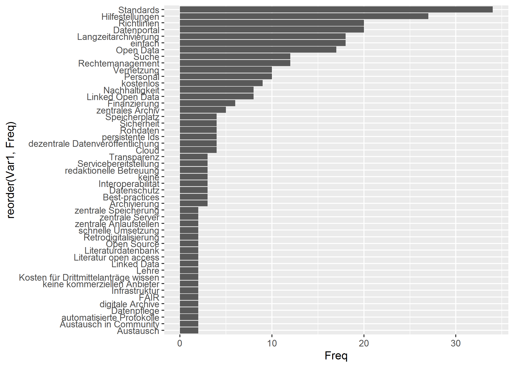

<!-- This is the format for text comments that will be ignored during renderings. Do not put R code in these comments because it will not be ignored. -->
<!-- With the following code you can access and display values from the yml header above. -->

Keywords:

Highlights:

<!-- The following code chunk defines some general settings how code chunks should behave. -->

Wie werden Daten gesichert?
===========================

Die häufigsten Back-Up-Methoden während der Projektphase sind das Netz
des Arbeitgebers, die externe Festplatte und lokale Rechner. Externe
Datenzentren, Versionierungssysteme und Fach-Repositorien liegen weit
abgeschlagen zusammen mit DVDs und CDs.

Im Vergleich zu der IANUS-Umfrage von 2013
(<a href="https://www.ianus-fdz.de/projects/ap3-community/wiki/Stakeholderanalyse" class="uri">https://www.ianus-fdz.de/projects/ap3-community/wiki/Stakeholderanalyse</a>)
ist dabei “der eigene Arbeitsrechner” vom “Zentralnetz des Arbeitgebers”
als häufigste Nennung abgelöst worden. Hier zeigt sich eine erste
Sensibilisierung der Einrichtungen gegenüber dem Thema der
Datenarchivierung. Die externe Festplatte und die lokalen Rechner
bleiben jedoch von großer Bedeutung.

Das ändert sich auch nicht durch die Nennungen unter “sonstiges”:
`ds_sonst`

### Datensicherung nach Projektende

Die Datensicherung nach Projektende wurde in einer Freitextfrage
abgefragt. Aus diesem Grund wird eine einfache text-mining Analyse
ausgeführt, die die am häufigsten genannten Wortstämme ausgibt.

    #>                          word freq
    #> festplatt           festplatt  102
    #> extern                 extern   91
    #> arbeitgeb           arbeitgeb   77
    #> serv                     serv   73
    #> netzlaufwerk     netzlaufwerk   38
    #> privat                 privat   34
    #> cloud                   cloud   29
    #> zentral               zentral   25
    #> institutionell institutionell   18
    #> rechn                   rechn   16
    #> institution       institution   15
    #> datenbank           datenbank   14
    #> digital               digital   12
    #> lokal                   lokal   11
    #> universitat       universitat   11
    #> analog                 analog   11
    #> archiv                 archiv   11
    #> projekt               projekt   10
    #> zenodo                 zenodo    8
    #> repositorium     repositorium    8
    #> laufwerk             laufwerk    8
    #> dienstlich         dienstlich    8
    #> eig                       eig    7
    #> intern                 intern    7
    #> netzwerk             netzwerk    7
    #> onlin                   onlin    7
    #> publikation       publikation    7
    #> sowi                     sowi    7
    #> speicher             speicher    6
    #> zusatz                 zusatz    6

FAIR Prinzipien
---------------

 Tatsächlich sind die FAIR-Prinzipien nicht
einmal der Hälfte derjenigen, die überhaupt eine Antwort gegeben hat,
bekannt.

Stellen Sie Ihre Daten nach Projektabschluss zur Verfügung?
-----------------------------------------------------------

Vergleichen wir diese Antworten mit der aus der IANUS-Umfrage von 2013
so fällt auf, dass noch immer die Daten am häufigsten auf individuelle
oder perönliche Anfrage herausgegeben werden. Die Bereitstellung der
Daten als Download über ein Datenportal hat sich jedoch prozentual im
Vergleich zu 2013 deutlich gesteigert.

### Kategorisierung der sonstiges Angaben

Unter den sonstigen Angaben stechen werden diese besonders häufig
genannt:

 Häufig wird auf Rechtsfragen /
Lizenzen etc. hingewiesen.

Die Publikation der Daten in dem Journal als supplementary data wird
angesprochen.

Viele nutzen unterschiedliche Wege, wobei hier der Punkt “persönlich”
häufig genannt wird und z.T. fachspezifische Repositorien genannt
werden. Unter “institutionell” verbergen sich Angabe nach dem Amt,
Instituten und dem Arbeitgeber.

Einzelne Interessante Wortmeldungen im O-Ton: Wir arbeiten an der
Bereitstellung. Damit das auch nachhaltig ist, sind Geld und Personal
nötig.,Welche digitalen Daten?, Ich würde gerne, aber es gibt kein
entsprechendes Repositorium/forschngsdatenarchiv, Ich kuemmere mich um
Archivierung bei Institutionrn und Behoerden und mache auf FAIR
Prinzipien aufmersam. Leider geht dennoch vieles unter oder erfordert
Finanzien, die nicht eingeplant waren..

Werden Daten anderer für die eigene Arbeit genutzt?
---------------------------------------------------

In diesem Kapitel kann man evtl. die vielen “NA”s, also keine Angaben
damit interpretieren, dass es Leute noch nicht probiert haben.

 Versuch einer Kategorisierung
der sonstigen Antworten:

Hinweise auf online Datenbanken (3x), Publikationen (vmtl als Print
gemeint, aber nicht eindeutig, 3x) und letztendlich persönliche Kontakte
(Kooperationen, Vorgängerprojekte etc) sind am häufigsten. Manchmal
werden mehrere Wege genannt.

### Welche Maßnahmen würden Sie sich wünschen (im Bezug auf Datenspeicherung in ihrem Arbeitsfeld)?

    #>                                word freq
    #> dat                             dat  120
    #> mehr                           mehr   57
    #> zugang                       zugang   54
    #> bess                           bess   39
    #> moglich                     moglich   38
    #> einheit                     einheit   36
    #> zentral                     zentral   34
    #> einfach                     einfach   30
    #> vernetz                     vernetz   28
    #> projekt                     projekt   25
    #> archivier                 archivier   24
    #> forschungsdat         forschungsdat   22
    #> standard                   standard   22
    #> datenbank                 datenbank   20
    #> digital                     digital   19
    #> gross                         gross   19
    #> klar                           klar   17
    #> langzeitarchivier langzeitarchivier   17
    #> sich                           sich   17
    #> datenspeicher         datenspeicher   16
    #> nutzung                     nutzung   15
    #> verfug                       verfug   15
    #> offent                       offent   14
    #> speicher                   speicher   14
    #> open                           open   14
    #> einricht                   einricht   13
    #> war                             war   13
    #> gut                             gut   13
    #> bereitstell             bereitstell   13
    #> objekt                       objekt   12

