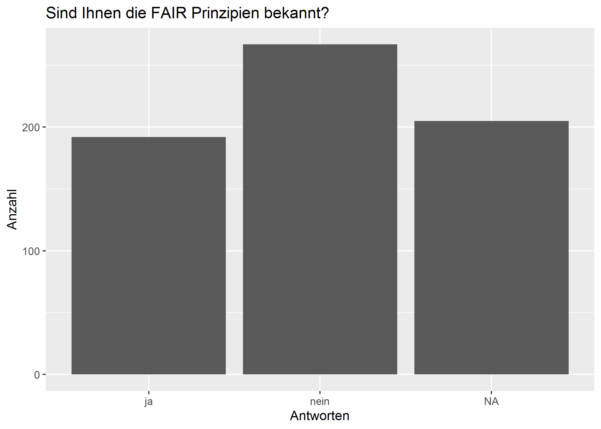
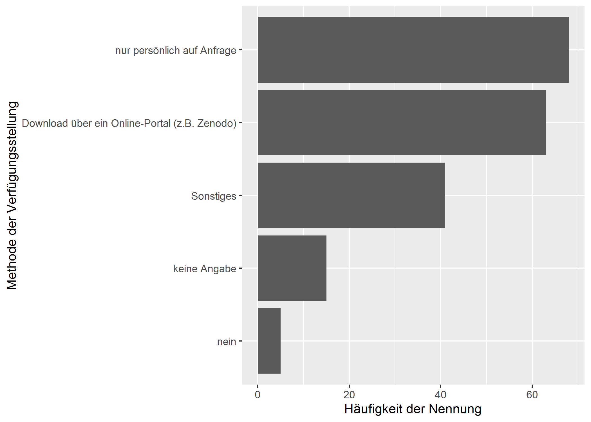
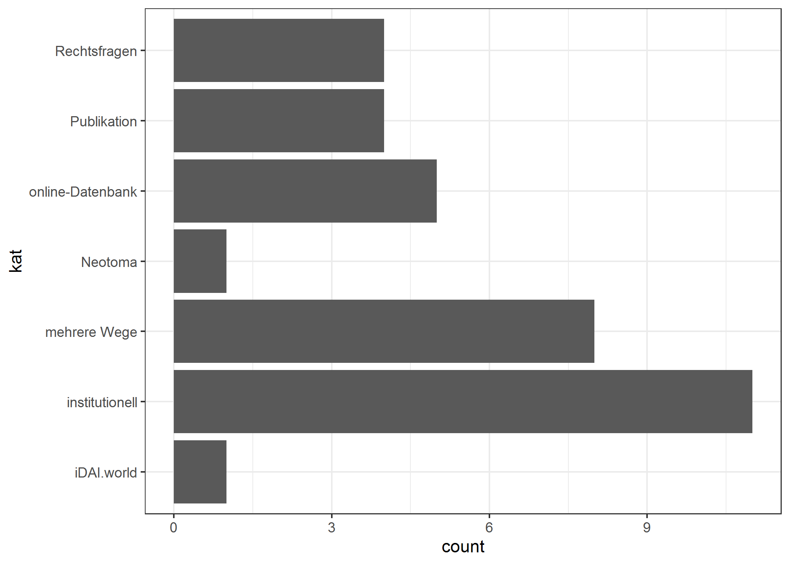
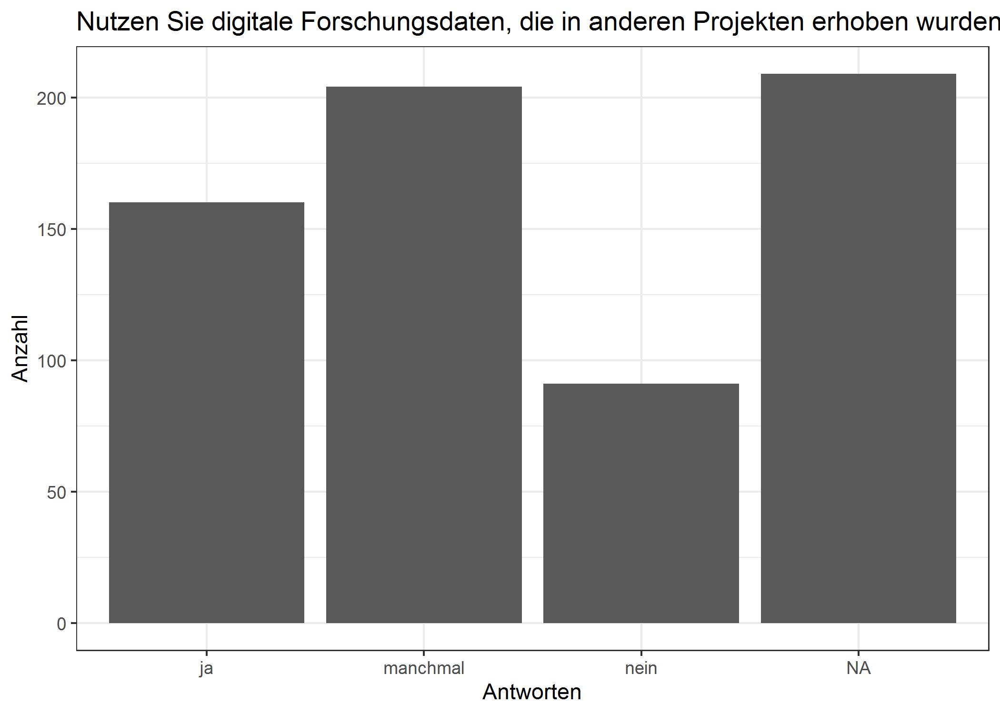
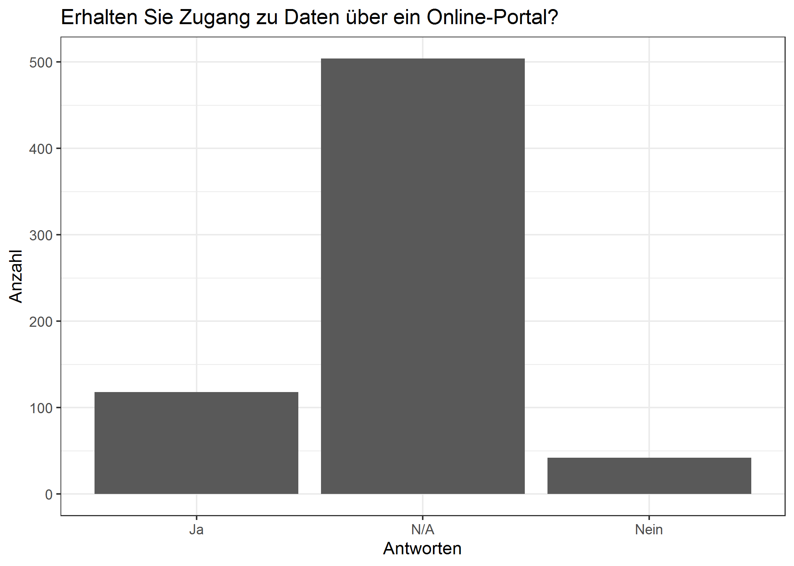
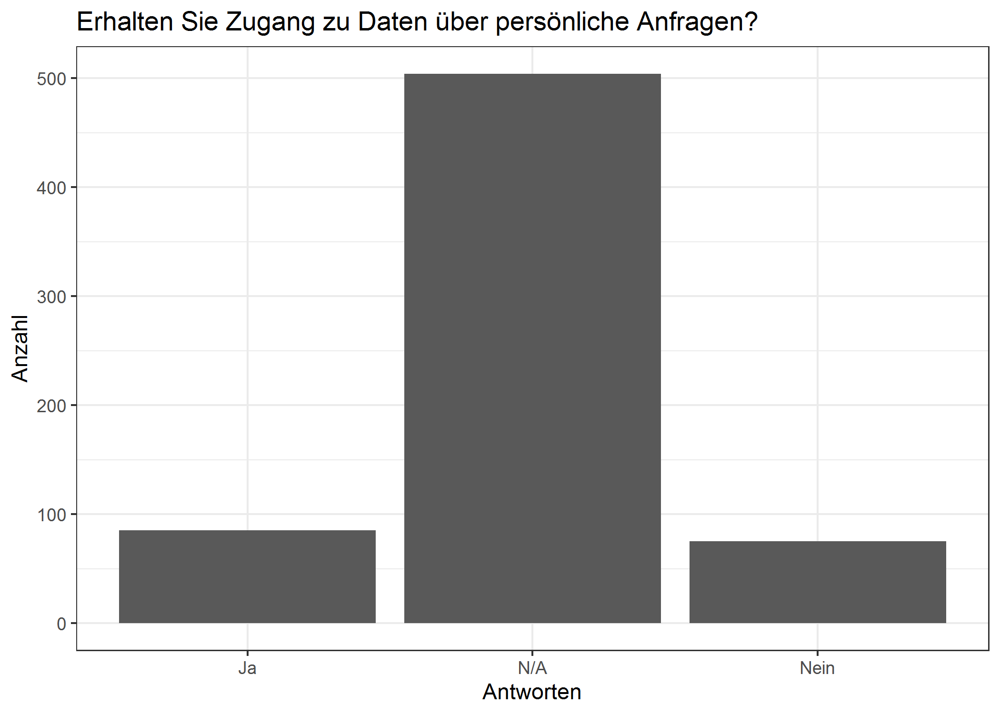
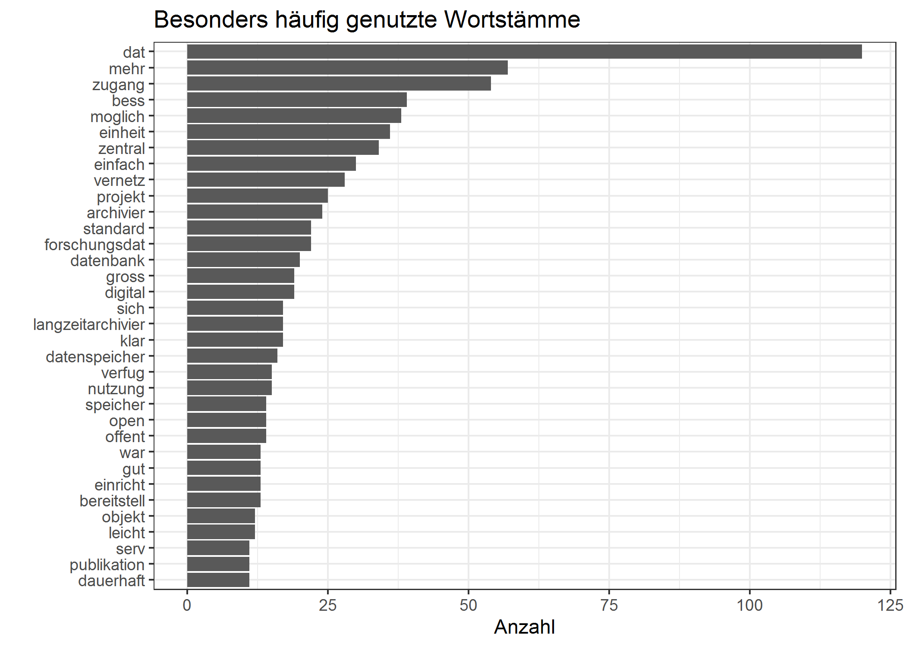

<!-- This is the format for text comments that will be ignored during renderings. Do not put R code in these comments because it will not be ignored. -->
<!-- With the following code you can access and display values from the yml header above. -->

Keywords:

Highlights:

<!-- The following code chunk defines some general settings how code chunks should behave. -->

Datengrundlage
==============

Daten als csv bekommen und IPs etc entfernt. Insgesamt über 600
Antworten, dabei aber viele, die sich “nur durchgeklickt” haben oder nur
Teile der Umfrage ausgefüllt haben (teilweise um die 70%).

Die häufigsten Back-Up-Methoden während der Projektphase sind das Netz
des Arbeitgebers, die externe Festplatte und lokale Rechner. Externe
Datenzentren, Versionierungssysteme und Fach-Repositorien liegen weit
abgeschlagen zusammen mit DVDs und CDs.

Das ändert sich auch nicht durch die Nennungen unter “sonstiges”:
`ds_sonst`

FAIR Prinzipien
---------------

 Tatsächlich sind die FAIR-Prinzipien nicht
einmal der Hälfte derjenigen, die überhaupt eine Antwort gegeben hat,
bekannt.

Stellen Sie Ihre Daten nach Projektabschluss zur Verfügung?
-----------------------------------------------------------

### Kategorisierung der sonstiges Angaben

Unter den sonstigen Angaben stechen werden diese besonders häufig
genannt:

 Häufig wird auf Rechtsfragen /
Lizenzen etc. hingewiesen.

Die Publikation der Daten in dem Journal als supplementary data wird
angesprochen.

Viele nutzen unterschiedliche Wege, wobei hier der Punkt “persönlich”
häufig genannt wird und z.T. fachspezifische Repositorien genannt
werden. Unter “institutionell” verbergen sich Angabe nach dem Amt,
Instituten und dem Arbeitgeber.

Einzelne Interessante Wortmeldungen im O-Ton: Wir arbeiten an der
Bereitstellung. Damit das auch nachhaltig ist, sind Geld und Personal
nötig.,Welche digitalen Daten?, Ich würde gerne, aber es gibt kein
entsprechendes Repositorium/forschngsdatenarchiv, Ich kuemmere mich um
Archivierung bei Institutionrn und Behoerden und mache auf FAIR
Prinzipien aufmersam. Leider geht dennoch vieles unter oder erfordert
Finanzien, die nicht eingeplant waren..

Werden Daten anderer für die eigene Arbeit genutzt?
---------------------------------------------------

In diesem Kapitel kann man evtl. die vielen “NA”s, also keine Angaben
damit interpretieren, dass es Leute noch nicht probiert haben.

 Versuch einer Kategorisierung
der sonstigen Antworten:

Hinweise auf online Datenbanken (3x), Publikationen (vmtl als Print
gemeint, aber nicht eindeutig, 3x) und letztendlich persönliche Kontakte
(Kooperationen, Vorgängerprojekte etc). Manchmal werden mehrere Wege
genannt.

### Welche Maßnahmen würden Sie sich wünschen (im Bezug auf Datenspeicherung in ihrem Arbeitsfeld)?

    #>                                      word freq
    #> daten                               daten  120
    #> mehr                                 mehr   51
    #> besser                             besser   37
    #> zentral                           zentral   30
    #> zugang                             zugang   28
    #> vernetzung                     vernetzung   28
    #> einheitlich                   einheitlich   28
    #> archivierung                 archivierung   23
    #> forschungsdaten           forschungsdaten   22
    #> einfach                           einfach   22
    #> standard                         standard   22
    #> langzeitarchivierung langzeitarchivierung   17
    #> datenspeicherung         datenspeicherung   16
    #> nutzung                           nutzung   15
    #> verfügung                       verfügung   15
    #> projekt                           projekt   15
    #> zugänglichkeit             zugänglichkeit   15
    #> speicherung                   speicherung   14
    #> open                                 open   14
    #> möglichkeit                   möglichkeit   14
    #> datenbanken                   datenbanken   13
    #> möglichkeiten               möglichkeiten   13
    #> digital                           digital   11
    #> klare                               klare   10
    #> dauerhaft                       dauerhaft   10
    #> bereitstellung             bereitstellung   10
    #> server                             server   10
    #> speicherplatz               speicherplatz   10
    #> publikationen               publikationen   10
    #> zugriff                           zugriff   10

