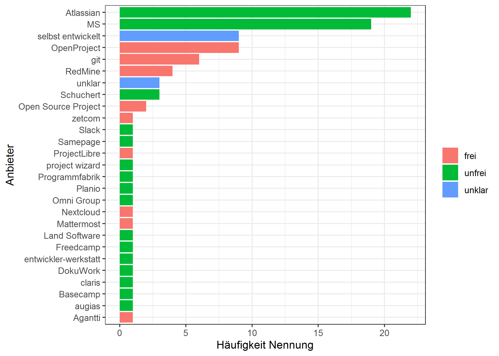

<!-- This is the format for text comments that will be ignored during renderings. Do not put R code in these comments because it will not be ignored. -->
<!-- With the following code you can access and display values from the yml header above. -->

Keywords:

Highlights:

<!-- The following code chunk defines some general settings how code chunks should behave. -->

Datengrundlage
==============

Daten als csv bekommen und IPs etc entfernt. Insgesamt über 600
Antworten, dabei aber viele, die sich “nur durchgeklickt” haben oder nur
Teile der Umfrage ausgefüllt haben (teilweise um die 70%).

Analyse der Software, die für Projektmanagement genutzt wird
============================================================

Häufigkeit der genannten Anbieter und ob dies freie oder proprietäre
Software ist:

Analyse Software, die für Forschungsdatenanalyse genutzt wird
=============================================================

1.  Datenvorbereitung

<!-- -->

    #>                  word freq
    #> excel           excel  238
    #> qgis             qgis  120
    #> access         access   39
    #> keine           keine   22
    #> word             word   17
    #> spss             spss   17
    #> arcgis         arcgis   16
    #> filemaker   filemaker   15
    #> python         python   14
    #> office         office   10
    #> past             past   10
    #> autocad       autocad    8
    #> software     software    7
    #> open             open    7
    #> calc             calc    6
    #> libre           libre    6
    #> gephi           gephi    6
    #> eigene         eigene    5
    #> oxcal           oxcal    5
    #> museumplus museumplus    5
    #> mapinfo       mapinfo    5
    #> meshlab       meshlab    5
    #> adobe           adobe    5
    #> gis               gis    4
    #> metashape   metashape    4
    #> idaifield   idaifield    4
    #> blender       blender    4
    #> origin         origin    4
    #> jmp               jmp    3
    #> sql               sql    3

1.  Visualisierung der Häufigkeiten der Nennung

 Zwei Programme werden extrem
häufig genannt: Excel und QGIS. Die beiden hervorgehobenen Punkte
“eigene” und “keine” sollen im Folgenden etwas im Detail analysiert
werden: Wer programmiert eigene Lösungen und wer benutzt gar keine
Analysesoftware?

### eigen programmierte Lösungen

    #>  [1] "MS Excel, Sparql, selbstgebauter Datenbankabfrage "                                                                                       
    #>  [2] "oXygen XML Editor\nselbstgeschriebene Software\nMS Excel"                                                                                 
    #>  [3] "R, ADP, selbstentwickelte Python-Applikationen"                                                                                           
    #>  [4] "eigene Software"                                                                                                                          
    #>  [5] "QGIS, eigene software Open Source"                                                                                                        
    #>  [6] "MS Excel, QGIS, eigene Entwicklungen zur Datenbankauswertung"                                                                             
    #>  [7] "MS Excel, QGIS  für die tägliche Arbeit / eigene Forschungsprojekte sind zur Zeit nicht in Bearbeitung"                                   
    #>  [8] "Hierzu kann ich keine Angaben machen. Ich suche/erforsche Daten, trage unsere eigenen Daten in der Datenbank ein, erstelle Dokumente."    
    #>  [9] "R, Excel, ADP (www.rgzm.de/adp), AMT (www.academic-meta-tool.xyz), SamianResearch (www.rgzm.de/samian), QGIS, ArcGIS, eigene Analysetools"
    #> [10] "Kein externer Dienst, nur dienststellen interne Datenbanken"                                                                              
    #> [11] "interne Fundstellendatenbank, QGIS, MS Excel"

<table>
<thead>
<tr>
<th style="text-align:left;">
Var1
</th>
<th style="text-align:right;">
Freq
</th>
</tr>
</thead>
<tbody>
<tr>
<td style="text-align:left;">
Außeruniversitäre Forschungseinrichtung
</td>
<td style="text-align:right;">
4
</td>
</tr>
<tr>
<td style="text-align:left;">
Denkmalbehörde
</td>
<td style="text-align:right;">
3
</td>
</tr>
<tr>
<td style="text-align:left;">
Sonstiges
</td>
<td style="text-align:right;">
2
</td>
</tr>
<tr>
<td style="text-align:left;">
Universität/Hochschule
</td>
<td style="text-align:right;">
1
</td>
</tr>
</tbody>
</table>

V.a. außeruniversitäre Forschungseinrichtungen (4x genannt) und
Denkmalbehörden (4x – einmal in sonstiges) wird selbständig Software
entwickelt.

### keine Angaben zu benutzer Software

Insgesamt sind sehr häufig keine Angaben gemacht worden. Im Nachhinein
herauszufiltern, warum dies geschah, kann kaum möglich.

19 x findet sich der Begriff “keine” o.ä. und 304 ist diese Frage nicht
beantwortet worden, also ca. die Hälfte der Antwortenden hat keine
Informationen dazu geben können / wollen.

*“Mit keinen so richtig. Weiterbildung wäre gut”* ist ein Hinweis einer
30-39jährigen Person. Zudem gab es 4x den Hinweis, dass die Analyse von
FD nicht zu den Aufgaben gehört.

Der Chi-Quadrat-Test zeigt, dass es keine Zusammenhänge zwischen Alter /
Einrichtung oder Gruppenzugehörigkeit und ob eine Angabe gemacht wurde
oder nicht, gibt.

genutzte Datenformate
---------------------

    #> <<SimpleCorpus>>
    #> Metadata:  corpus specific: 1, document level (indexed): 0
    #> Content:  documents: 1
    #> 
    #> [1] c("software proprietäre formate", "txt", "cdr eps", "Markdown, SVG", "PLY", "Geodatabases (.gdb)", "dwg", "wav, mp3, mkv, avi, mpeg 4 ", "Wavefront *.obj", "jdx", "lido", "Sequencing Data (FastQ, BAM Files)", "netcdf", "Obj (für 3D)", "mus", "jmp, indd, ddd, zip, ico, ai, mdb, acddb, svg, eps, txt, ", "czi, ai, hp3d", "kml, vrt (Raster), obj (3D), stl (3D), LAZ (Laser), zLAS (Laser)", ".Rscript., .svg", "R, Rmd", "ttl,rdf,geojson-ld", "sql", "ai, pptx", "Lido", "osm", "vg, atos", "indd, ai, fmp12", \n"Apple Formate ", ".ndt; .wsng; .vieng", "TIFF", "Tif", "wav, mp4, kml, ps, gmp", "Fotos: RAW, DNG usw., Datenbanken, Harris-Matrix", "dwg", "obj, pcg, ftr, gsi, dxf, isproj", "PDF/A", "dwg", "ASCII", "wld, dxf, cdr", "txt", ".fm, .psd", ".blend, dae", "tiff", "md", "dwg, dxf", "dbf, sqlite, md, Rmd, txt, mdb, R", "svg", "dwg", "na", "tiff, DAtenbankeinträge!", "md", "raw", "pts, u3d, obj, ply", ".accdb; .tex", "python", "ai; svg; dwg; dxf", "obj,", "gdb.", "Photoshop Format", "diverse weitere", \n"geopackage", "geopackage", "aphoto, gephi, tex, diverse interne", "svg", "ai psd 3D-Formate", "dwg", "dwg", "id", "psd", "map", "dwg", "spc, zvi und weietre native Analysenformate", ".hmcx, .gephi, oxcal", "dwg, mde", "rdf", "cxt, stx, asc, sp, txt, etc. ", "ppt, fp, ai", "ai", "accdb", "obj", "ctv6", "ai", "svg", "OBJ | PLY | STL", "Eps; tiff", ".scriv (XML)", "db", "obj, ply, ...", "mp4, wav", "fbx obj", "ai, tiff, dxf, dwg", "diverse GPS-Formate", "RDF", "txt", "ply / stl / pts / ptx / e57 / postgresql ", \n"TIFF", "cdr, tiff, bmp, svg, shape", "dwg", "dwg, dxf", "psd", "mdb", "obj", "tex, md", "fmp12", "gpkg", "ai, indd, obj, dwg, dxt, fmp", "ply, obj ", "ply", "DWG, SQL", "gif, svg", "dwg")
    #>                                word freq
    #> tiff                           tiff    7
    #> diverse                     diverse    3
    #> indd                           indd    3
    #> accdb                         accdb    2
    #> fmp12                         fmp12    2
    #> geopackage               geopackage    2
    #> lido                           lido    2
    #> acddb                         acddb    1
    #> analysenformate     analysenformate    1
    #> aphoto                       aphoto    1
    #> apple                         apple    1
    #> ascii                         ascii    1
    #> atos                           atos    1
    #> blend                         blend    1
    #> ctv6                           ctv6    1
    #> data                           data    1
    #> datenbankeinträge datenbankeinträge    1
    #> datenbanken             datenbanken    1
    #> fastq                         fastq    1
    #> files                         files    1
    #> format                       format    1
    #> fotos                         fotos    1
    #> geodatabases           geodatabases    1
    #> geojson                     geojson    1
    #> gephi                         gephi    1
    #> gpkg                           gpkg    1
    #> harrismatrix           harrismatrix    1
    #> hmcxgephi                 hmcxgephi    1
    #> hp3d                           hp3d    1
    #> interne                     interne    1

 Insgesamt 67
unterschiedliche Datenformate, darunter sehr spezialisierte
Ausgabeformate von bestimmten Geräten (z.B. Laserscannern). Dargestellt
sind hier diejenigen die häufiger als 2x genannt wurden.

Acknowledgements
================

<!-- The following line inserts a page break  -->
References
==========

<!-- The following line ensures the references appear here for the MS Word or HTML output files, rather than right at the end of the document (this will not work for PDF files):  -->

### Colophon

This report was generated on 2020-07-31 17:26:36 using the following
computational environment and dependencies:

    #> - Session info ---------------------------------------------------------------
    #>  setting  value                       
    #>  version  R version 4.0.0 (2020-04-24)
    #>  os       Windows 7 x64 SP 1          
    #>  system   x86_64, mingw32             
    #>  ui       RTerm                       
    #>  language (EN)                        
    #>  collate  German_Germany.1252         
    #>  ctype    German_Germany.1252         
    #>  tz       Europe/Berlin               
    #>  date     2020-07-31                  
    #> 
    #> - Packages -------------------------------------------------------------------
    #>  package     * version date       lib source        
    #>  assertthat    0.2.1   2019-03-21 [1] CRAN (R 4.0.0)
    #>  backports     1.1.6   2020-04-05 [1] CRAN (R 4.0.0)
    #>  callr         3.4.3   2020-03-28 [1] CRAN (R 4.0.0)
    #>  cli           2.0.2   2020-02-28 [1] CRAN (R 4.0.0)
    #>  colorspace    1.4-1   2019-03-18 [1] CRAN (R 4.0.0)
    #>  crayon        1.3.4   2017-09-16 [1] CRAN (R 4.0.0)
    #>  desc          1.2.0   2018-05-01 [1] CRAN (R 4.0.0)
    #>  devtools      2.3.1   2020-07-21 [1] CRAN (R 4.0.2)
    #>  digest        0.6.25  2020-02-23 [1] CRAN (R 4.0.0)
    #>  dplyr       * 1.0.0   2020-05-29 [1] CRAN (R 4.0.0)
    #>  ellipsis      0.3.0   2019-09-20 [1] CRAN (R 4.0.0)
    #>  evaluate      0.14    2019-05-28 [1] CRAN (R 4.0.0)
    #>  fansi         0.4.1   2020-01-08 [1] CRAN (R 4.0.0)
    #>  farver        2.0.3   2020-01-16 [1] CRAN (R 4.0.0)
    #>  fs            1.4.2   2020-06-30 [1] CRAN (R 4.0.2)
    #>  generics      0.0.2   2018-11-29 [1] CRAN (R 4.0.0)
    #>  ggplot2     * 3.3.0   2020-03-05 [1] CRAN (R 4.0.0)
    #>  glue          1.4.1   2020-05-13 [1] CRAN (R 4.0.2)
    #>  gtable        0.3.0   2019-03-25 [1] CRAN (R 4.0.0)
    #>  highr         0.8     2019-03-20 [1] CRAN (R 4.0.0)
    #>  hms           0.5.3   2020-01-08 [1] CRAN (R 4.0.0)
    #>  htmltools     0.4.0   2019-10-04 [1] CRAN (R 4.0.0)
    #>  httr          1.4.2   2020-07-20 [1] CRAN (R 4.0.2)
    #>  kableExtra  * 1.1.0   2019-03-16 [1] CRAN (R 4.0.2)
    #>  knitr         1.28    2020-02-06 [1] CRAN (R 4.0.0)
    #>  labeling      0.3     2014-08-23 [1] CRAN (R 4.0.0)
    #>  lifecycle     0.2.0   2020-03-06 [1] CRAN (R 4.0.0)
    #>  magrittr    * 1.5     2014-11-22 [1] CRAN (R 4.0.0)
    #>  memoise       1.1.0   2017-04-21 [1] CRAN (R 4.0.0)
    #>  munsell       0.5.0   2018-06-12 [1] CRAN (R 4.0.0)
    #>  NLP         * 0.2-0   2018-10-18 [1] CRAN (R 4.0.0)
    #>  pillar        1.4.3   2019-12-20 [1] CRAN (R 4.0.0)
    #>  pkgbuild      1.0.7   2020-04-25 [1] CRAN (R 4.0.0)
    #>  pkgconfig     2.0.3   2019-09-22 [1] CRAN (R 4.0.0)
    #>  pkgload       1.0.2   2018-10-29 [1] CRAN (R 4.0.0)
    #>  prettyunits   1.1.1   2020-01-24 [1] CRAN (R 4.0.0)
    #>  processx      3.4.2   2020-02-09 [1] CRAN (R 4.0.0)
    #>  ps            1.3.2   2020-02-13 [1] CRAN (R 4.0.0)
    #>  purrr         0.3.4   2020-04-17 [1] CRAN (R 4.0.0)
    #>  R6            2.4.1   2019-11-12 [1] CRAN (R 4.0.0)
    #>  Rcpp          1.0.4.6 2020-04-09 [1] CRAN (R 4.0.0)
    #>  readr         1.3.1   2018-12-21 [1] CRAN (R 4.0.2)
    #>  remotes       2.2.0   2020-07-21 [1] CRAN (R 4.0.2)
    #>  rlang         0.4.7   2020-07-09 [1] CRAN (R 4.0.2)
    #>  rmarkdown     2.3     2020-06-18 [1] CRAN (R 4.0.2)
    #>  rprojroot     1.3-2   2018-01-03 [1] CRAN (R 4.0.0)
    #>  rstudioapi    0.11    2020-02-07 [1] CRAN (R 4.0.0)
    #>  rvest         0.3.5   2019-11-08 [1] CRAN (R 4.0.0)
    #>  scales        1.1.0   2019-11-18 [1] CRAN (R 4.0.0)
    #>  sessioninfo   1.1.1   2018-11-05 [1] CRAN (R 4.0.0)
    #>  slam          0.1-47  2019-12-21 [1] CRAN (R 4.0.0)
    #>  SnowballC   * 0.7.0   2020-04-01 [1] CRAN (R 4.0.0)
    #>  stringi       1.4.6   2020-02-17 [1] CRAN (R 4.0.0)
    #>  stringr       1.4.0   2019-02-10 [1] CRAN (R 4.0.0)
    #>  testthat      2.3.2   2020-03-02 [1] CRAN (R 4.0.0)
    #>  tibble        3.0.0   2020-03-30 [1] CRAN (R 4.0.0)
    #>  tidyr       * 1.0.3   2020-05-07 [1] CRAN (R 4.0.0)
    #>  tidyselect    1.1.0   2020-05-11 [1] CRAN (R 4.0.0)
    #>  tm          * 0.7-7   2019-12-12 [1] CRAN (R 4.0.2)
    #>  usethis       1.6.1   2020-04-29 [1] CRAN (R 4.0.0)
    #>  vctrs         0.3.1   2020-06-05 [1] CRAN (R 4.0.2)
    #>  viridisLite   0.3.0   2018-02-01 [1] CRAN (R 4.0.0)
    #>  webshot       0.5.2   2019-11-22 [1] CRAN (R 4.0.2)
    #>  withr         2.2.0   2020-04-20 [1] CRAN (R 4.0.0)
    #>  xfun          0.14    2020-05-20 [1] CRAN (R 4.0.0)
    #>  xml2          1.3.1   2020-04-09 [1] CRAN (R 4.0.0)
    #>  yaml          2.2.1   2020-02-01 [1] CRAN (R 4.0.0)
    #> 
    #> [1] C:/Users/SCSchmidt/Documents/R/win-library/4.0
    #> [2] C:/Program Files/R/R-4.0.0/library

The current Git commit details are:

    #> Local:    gh-page E:/R/N4Oumfrage
    #> Remote:   gh-page @ origin (https://github.com/SCSchmidt/N4Oumfrage)
    #> Head:     [cabf352] 2020-07-31: weiterführung der analyse
