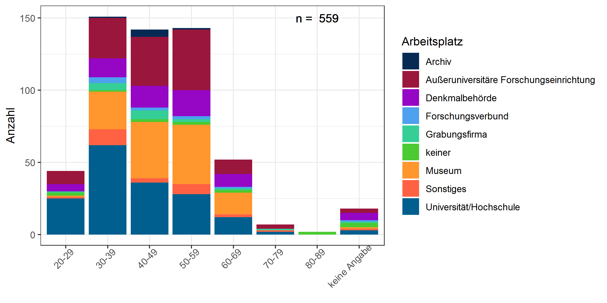
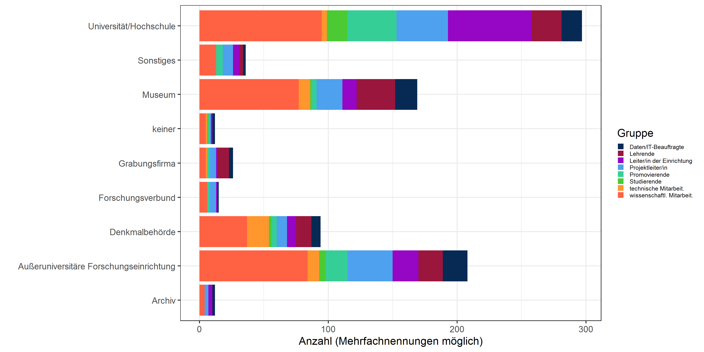
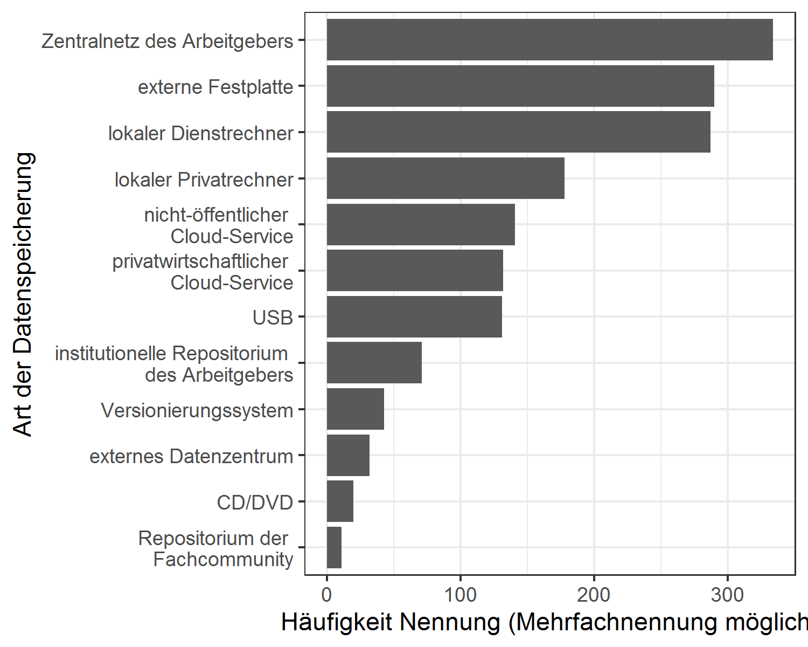

<!-- This is the format for text comments that will be ignored during renderings. Do not put R code in these comments because it will not be ignored. -->
<!-- With the following code you can access and display values from the yml header above. -->

Keywords:

Highlights:

<!-- The following code chunk defines some general settings how code chunks should behave. -->

    ## Warning: package 'kableExtra' was built under R version 4.0.2

Datengrundlage
==============

Insgesamt haben wir 664 Antworten erhalten, das ist ein deutlich
größerer Rücklauf als bei der Aridande+ - Umfrage von 2019
(<a href="https://ariadne-infrastructure.eu/key-results-of-the-community-needs-survey/" class="uri">https://ariadne-infrastructure.eu/key-results-of-the-community-needs-survey/</a>)
und der IANUS-Umfrage von 2013
(<a href="https://www.ianus-fdz.de/projects/ergebnisse/wiki" class="uri">https://www.ianus-fdz.de/projects/ergebnisse/wiki</a>).

Mögliche Gründe: erhöhtes Interesse der Community an dem Thema,
breiteres Spektrum an Fächern (siehe unten) repräsentiert, nicht nur
Archäologie, NFDI-Prozess hat Aufmerksamkeit erregt?

Demographische Angaben
======================

Zuerst einige allgemeine Statistiken zu der Teilnehmergruppe:

Alter und Beschäftigungsverhältnis
----------------------------------

 Wir haben knapp 50
20-29jährige, der Großteil der Befragten ist zwischen 30 und 60 Jahre
alt und arbeitet an einer Hochschule, in der Forschung, im Museum oder
in einer Denkmalbehörde (man beachte die zweo über 80jährige Personen,
die nicht mehr arbeiten…). Seltener kommen Grabungsfirmen und Archive
vor. Eine ähnliche Verteilung hatten die Umfrageteilnehmer bei Ariadne+
und IANUS.

<table>
<thead>
<tr>
<th style="text-align:left;">
Alter
</th>
<th style="text-align:right;">
n
</th>
<th style="text-align:right;">
Prozent
</th>
</tr>
</thead>
<tbody>
<tr>
<td style="text-align:left;">
20-29
</td>
<td style="text-align:right;">
48
</td>
<td style="text-align:right;">
8.0
</td>
</tr>
<tr>
<td style="text-align:left;">
30-39
</td>
<td style="text-align:right;">
159
</td>
<td style="text-align:right;">
26.6
</td>
</tr>
<tr>
<td style="text-align:left;">
40-49
</td>
<td style="text-align:right;">
153
</td>
<td style="text-align:right;">
25.6
</td>
</tr>
<tr>
<td style="text-align:left;">
50-59
</td>
<td style="text-align:right;">
155
</td>
<td style="text-align:right;">
25.9
</td>
</tr>
<tr>
<td style="text-align:left;">
60-69
</td>
<td style="text-align:right;">
56
</td>
<td style="text-align:right;">
9.4
</td>
</tr>
<tr>
<td style="text-align:left;">
70-79
</td>
<td style="text-align:right;">
7
</td>
<td style="text-align:right;">
1.2
</td>
</tr>
<tr>
<td style="text-align:left;">
80-89
</td>
<td style="text-align:right;">
2
</td>
<td style="text-align:right;">
0.3
</td>
</tr>
<tr>
<td style="text-align:left;">
keine Angabe
</td>
<td style="text-align:right;">
18
</td>
<td style="text-align:right;">
3.0
</td>
</tr>
</tbody>
</table>

Der Großteil der Befragten arbeitete an einer Universität oder
Hochschule, in einer Forschungseinrichtung einem Museum oder einer
Denkmalbehörde:

<table>
<thead>
<tr>
<th style="text-align:left;">
Einrichtung
</th>
<th style="text-align:right;">
n
</th>
<th style="text-align:right;">
Prozent
</th>
</tr>
</thead>
<tbody>
<tr>
<td style="text-align:left;">
Universität/Hochschule
</td>
<td style="text-align:right;">
168
</td>
<td style="text-align:right;">
30.1
</td>
</tr>
<tr>
<td style="text-align:left;">
Außeruniversitäre Forschungseinrichtung
</td>
<td style="text-align:right;">
129
</td>
<td style="text-align:right;">
23.1
</td>
</tr>
<tr>
<td style="text-align:left;">
Museum
</td>
<td style="text-align:right;">
123
</td>
<td style="text-align:right;">
22.0
</td>
</tr>
<tr>
<td style="text-align:left;">
Denkmalbehörde
</td>
<td style="text-align:right;">
65
</td>
<td style="text-align:right;">
11.6
</td>
</tr>
<tr>
<td style="text-align:left;">
Sonstiges
</td>
<td style="text-align:right;">
26
</td>
<td style="text-align:right;">
4.7
</td>
</tr>
<tr>
<td style="text-align:left;">
Grabungsfirma
</td>
<td style="text-align:right;">
17
</td>
<td style="text-align:right;">
3.0
</td>
</tr>
<tr>
<td style="text-align:left;">
keiner
</td>
<td style="text-align:right;">
14
</td>
<td style="text-align:right;">
2.5
</td>
</tr>
<tr>
<td style="text-align:left;">
Forschungsverbund
</td>
<td style="text-align:right;">
10
</td>
<td style="text-align:right;">
1.8
</td>
</tr>
<tr>
<td style="text-align:left;">
Archiv
</td>
<td style="text-align:right;">
7
</td>
<td style="text-align:right;">
1.3
</td>
</tr>
</tbody>
</table>

Mit ca. 51% männlichen und 42% weiblichen sowie 2 diversen
Teilnehmer\*innen (und keine Angabe: 6%) sind auch hier die
Teilnehmer\*innen repräsentativ.

Einrichtungen und Gruppe
------------------------

Innerhalb der Einrichtungen teilen sich die Teilnehmer\*innen auf
folgende Gruppen auf:

 Das Gros besteht aus
wissenschaftlichen Mitarbeiterinnen an der Hochschule, in Museen und in
Forschungseinrichtungen.

<table>
<thead>
<tr>
<th style="text-align:left;">
Gruppe
</th>
<th style="text-align:right;">
n
</th>
<th style="text-align:right;">
Prozent
</th>
</tr>
</thead>
<tbody>
<tr>
<td style="text-align:left;">
wissenschaftliche Mitarbeiter/innen
</td>
<td style="text-align:right;">
326
</td>
<td style="text-align:right;">
37.5
</td>
</tr>
<tr>
<td style="text-align:left;">
Projektleiter
</td>
<td style="text-align:right;">
125
</td>
<td style="text-align:right;">
14.4
</td>
</tr>
<tr>
<td style="text-align:left;">
Lehrende
</td>
<td style="text-align:right;">
114
</td>
<td style="text-align:right;">
13.1
</td>
</tr>
<tr>
<td style="text-align:left;">
Leiter/in der Einrichtung
</td>
<td style="text-align:right;">
96
</td>
<td style="text-align:right;">
11.0
</td>
</tr>
<tr>
<td style="text-align:left;">
Promovierende
</td>
<td style="text-align:right;">
73
</td>
<td style="text-align:right;">
8.4
</td>
</tr>
<tr>
<td style="text-align:left;">
Daten/IT-Beauftragte
</td>
<td style="text-align:right;">
69
</td>
<td style="text-align:right;">
7.9
</td>
</tr>
<tr>
<td style="text-align:left;">
technische Mitarbeiter/innen
</td>
<td style="text-align:right;">
41
</td>
<td style="text-align:right;">
4.7
</td>
</tr>
<tr>
<td style="text-align:left;">
Studierende
</td>
<td style="text-align:right;">
25
</td>
<td style="text-align:right;">
2.9
</td>
</tr>
</tbody>
</table>

\#\#Vertretene Disziplinen

<table>
<thead>
<tr>
<th style="text-align:left;">
Disziplin
</th>
<th style="text-align:right;">
n
</th>
<th style="text-align:right;">
Prozent
</th>
</tr>
</thead>
<tbody>
<tr>
<td style="text-align:left;">
Archäologie
</td>
<td style="text-align:right;">
327
</td>
<td style="text-align:right;">
49.2
</td>
</tr>
<tr>
<td style="text-align:left;">
keine Angabe
</td>
<td style="text-align:right;">
120
</td>
<td style="text-align:right;">
18.1
</td>
</tr>
<tr>
<td style="text-align:left;">
MINT
</td>
<td style="text-align:right;">
30
</td>
<td style="text-align:right;">
4.5
</td>
</tr>
<tr>
<td style="text-align:left;">
Musikwissenschaft
</td>
<td style="text-align:right;">
23
</td>
<td style="text-align:right;">
3.5
</td>
</tr>
<tr>
<td style="text-align:left;">
Kunst
</td>
<td style="text-align:right;">
21
</td>
<td style="text-align:right;">
3.2
</td>
</tr>
<tr>
<td style="text-align:left;">
Geschichte
</td>
<td style="text-align:right;">
19
</td>
<td style="text-align:right;">
2.9
</td>
</tr>
<tr>
<td style="text-align:left;">
Archäo-Wissenschaften
</td>
<td style="text-align:right;">
15
</td>
<td style="text-align:right;">
2.3
</td>
</tr>
<tr>
<td style="text-align:left;">
Denkmalpflege und Bauforschung
</td>
<td style="text-align:right;">
15
</td>
<td style="text-align:right;">
2.3
</td>
</tr>
<tr>
<td style="text-align:left;">
Restaurationswissenschaften
</td>
<td style="text-align:right;">
15
</td>
<td style="text-align:right;">
2.3
</td>
</tr>
<tr>
<td style="text-align:left;">
IT
</td>
<td style="text-align:right;">
14
</td>
<td style="text-align:right;">
2.1
</td>
</tr>
<tr>
<td style="text-align:left;">
Geistes-und Kulturwissenschaften
</td>
<td style="text-align:right;">
13
</td>
<td style="text-align:right;">
2.0
</td>
</tr>
<tr>
<td style="text-align:left;">
sonstige
</td>
<td style="text-align:right;">
12
</td>
<td style="text-align:right;">
1.8
</td>
</tr>
<tr>
<td style="text-align:left;">
Museologie
</td>
<td style="text-align:right;">
10
</td>
<td style="text-align:right;">
1.5
</td>
</tr>
<tr>
<td style="text-align:left;">
Numismatik
</td>
<td style="text-align:right;">
8
</td>
<td style="text-align:right;">
1.2
</td>
</tr>
<tr>
<td style="text-align:left;">
Altertumswissenschaften
</td>
<td style="text-align:right;">
7
</td>
<td style="text-align:right;">
1.1
</td>
</tr>
<tr>
<td style="text-align:left;">
Anthropologie
</td>
<td style="text-align:right;">
7
</td>
<td style="text-align:right;">
1.1
</td>
</tr>
<tr>
<td style="text-align:left;">
Digitales
</td>
<td style="text-align:right;">
5
</td>
<td style="text-align:right;">
0.8
</td>
</tr>
<tr>
<td style="text-align:left;">
Bibliothekswissenschaft
</td>
<td style="text-align:right;">
2
</td>
<td style="text-align:right;">
0.3
</td>
</tr>
<tr>
<td style="text-align:left;">
Provenienzforschung
</td>
<td style="text-align:right;">
1
</td>
<td style="text-align:right;">
0.2
</td>
</tr>
</tbody>
</table>

Die Angaben zur Disziplinzugehörigkeit waren von unterschiedlicher
Genauigkeit. Zusammengefasst sieht man eine große Vielfalt
unterschiedlicher Archäologischer Disziplinen (allgemein, UFG, AdRP,
Ägyptologie, vorderasiatische Archäologie, Mittelalter und Neuzeit etc
pp), zusammen etwa 50% aller Antworten. Häufig genannt wurden außerdem
Musikwissenschaft, Kunstgeschichte, Geschichte,
Restaurationswissenschaften, unterschiedliche IT-Bereiche,
Denkmalpflege, Museologie, Numismatik und unterschiedliche
interdisziplinären Felder wie Archäometrie, Geoinformatik und DH. –\>
deutlich breiter aufgestellt als IANUS 2013
(<a href="https://www.ianus-fdz.de/attachments/download/774/Teil1-Ergebnisse_2014-02-26_FINAL.pdf" class="uri">https://www.ianus-fdz.de/attachments/download/774/Teil1-Ergebnisse_2014-02-26_FINAL.pdf</a>,
S. 6)

Analyse zum Thema Erfahrungen im Bereich FMD und Bedeutung von FDM für die tägliche Arbeit
==========================================================================================

Alter und Erfahrung + Wichtung
------------------------------

Gibt es einen Zusammenhang zwischen dem Alter der Teilnehmenden Person,
der Erfahrung die sie in digitalen Forschungsdatenmanagement hat und dem
Gewicht, dass sie dem sie ihm zuweist?

 Alle Altersgruppen haben sehr
gemischt Erfahrungen und Wissensstände mit digitalem Datenmanagement.
Bei den Senioren (70-79) lassen sich zwei Gruppen differenzieren (viel
Ahnung - wenig Ahnung), sie halten digitales Forschungsdatenmanagement
allgemein für weniger wichtig für ihre tägliche Arbeit.

Jüngere Teilnehmende schätzen ihre eigene Erfahrung deutlich geringer
ein als diejenigen “die im Beruf stehen” und zwischen 30 und 60 Jahre
alt sind. Diese Gruppe scheint dem digitalen FDM auch den höchsten
Stellenwert in ihrer täglichen Arbeit zuzuweisen.

Wer viel von Forschungsdatenmanagement hält, scheint sich häufig schon
recht gut weitergebildet zu haben (oder anders herum: Einschätzung der
Wichtigkeit kommt von eigener Erfahrung!). Nur wenige Personen geben an,
ihre Erfahrung als mittig einzuschätzen, wenn sie FDM für wichtig halten
und die gelben Punkte (sehr hoher Stellenwert des digitalen FDM für die
eigene Arbeit) häufen sich im Bereich "viel Erfahrung).

Diese Ergebnisse sollten statistische getestet werden (Details siehe
[detailliertere
Auswertung](https://github.com/SCSchmidt/N4Oumfrage/blob/master/docs/md/Auswertung1.md):

Der Chi-Quadrat-Test darf eigentlich für diese Daten nicht angewendet
werden, da die Erwartungswerte zu gering werden (Anzahl der Teilnehmer
muss auf zu viele Subgruppen aufgeteilt werden). Anhand der Residuen
lassen sich trotzdem Erkenntnisse erarbeiten:
<table>
<thead>
<tr>
<th style="text-align:left;">
</th>
<th style="text-align:right;">
0
</th>
<th style="text-align:right;">
1
</th>
<th style="text-align:right;">
2
</th>
<th style="text-align:right;">
3
</th>
<th style="text-align:right;">
4
</th>
<th style="text-align:right;">
5
</th>
<th style="text-align:right;">
6
</th>
<th style="text-align:right;">
7
</th>
<th style="text-align:right;">
8
</th>
<th style="text-align:right;">
9
</th>
<th style="text-align:right;">
10
</th>
</tr>
</thead>
<tbody>
<tr>
<td style="text-align:left;">
20-29
</td>
<td style="text-align:right;">
3.8467257
</td>
<td style="text-align:right;">
0.7493150
</td>
<td style="text-align:right;">
0.6056988
</td>
<td style="text-align:right;">
-0.5585837
</td>
<td style="text-align:right;">
0.4319039
</td>
<td style="text-align:right;">
1.8617680
</td>
<td style="text-align:right;">
-0.8348121
</td>
<td style="text-align:right;">
-0.0700738
</td>
<td style="text-align:right;">
-1.3771583
</td>
<td style="text-align:right;">
-1.4837688
</td>
<td style="text-align:right;">
-0.6176096
</td>
</tr>
<tr>
<td style="text-align:left;">
30-39
</td>
<td style="text-align:right;">
-1.4000080
</td>
<td style="text-align:right;">
-2.0022822
</td>
<td style="text-align:right;">
-1.1092119
</td>
<td style="text-align:right;">
-0.4174018
</td>
<td style="text-align:right;">
-2.2305213
</td>
<td style="text-align:right;">
0.2830387
</td>
<td style="text-align:right;">
0.0296870
</td>
<td style="text-align:right;">
1.8690909
</td>
<td style="text-align:right;">
1.7465459
</td>
<td style="text-align:right;">
-1.0109201
</td>
<td style="text-align:right;">
-0.0176593
</td>
</tr>
<tr>
<td style="text-align:left;">
40-49
</td>
<td style="text-align:right;">
-0.9517655
</td>
<td style="text-align:right;">
-0.1711350
</td>
<td style="text-align:right;">
0.7899794
</td>
<td style="text-align:right;">
0.0323994
</td>
<td style="text-align:right;">
0.6209762
</td>
<td style="text-align:right;">
-1.8662030
</td>
<td style="text-align:right;">
2.2736627
</td>
<td style="text-align:right;">
-1.5270263
</td>
<td style="text-align:right;">
-0.3181113
</td>
<td style="text-align:right;">
1.6992465
</td>
<td style="text-align:right;">
0.3190514
</td>
</tr>
<tr>
<td style="text-align:left;">
50-59
</td>
<td style="text-align:right;">
0.9853587
</td>
<td style="text-align:right;">
1.1626371
</td>
<td style="text-align:right;">
-1.4624538
</td>
<td style="text-align:right;">
-0.6885075
</td>
<td style="text-align:right;">
1.0477909
</td>
<td style="text-align:right;">
0.5787477
</td>
<td style="text-align:right;">
-1.6913316
</td>
<td style="text-align:right;">
-0.3717308
</td>
<td style="text-align:right;">
0.0356545
</td>
<td style="text-align:right;">
0.7496422
</td>
<td style="text-align:right;">
0.9039243
</td>
</tr>
<tr>
<td style="text-align:left;">
60-69
</td>
<td style="text-align:right;">
-0.3040013
</td>
<td style="text-align:right;">
2.0072586
</td>
<td style="text-align:right;">
0.9447543
</td>
<td style="text-align:right;">
1.6362601
</td>
<td style="text-align:right;">
0.4195709
</td>
<td style="text-align:right;">
0.6034092
</td>
<td style="text-align:right;">
-0.2809318
</td>
<td style="text-align:right;">
0.0450691
</td>
<td style="text-align:right;">
-1.0461815
</td>
<td style="text-align:right;">
-0.9215733
</td>
<td style="text-align:right;">
-1.4922342
</td>
</tr>
<tr>
<td style="text-align:left;">
70-79
</td>
<td style="text-align:right;">
-0.3878289
</td>
<td style="text-align:right;">
-0.4113547
</td>
<td style="text-align:right;">
1.9701390
</td>
<td style="text-align:right;">
2.4245798
</td>
<td style="text-align:right;">
-0.6787006
</td>
<td style="text-align:right;">
-1.1054825
</td>
<td style="text-align:right;">
-0.9299811
</td>
<td style="text-align:right;">
-0.2755361
</td>
<td style="text-align:right;">
-0.5205169
</td>
<td style="text-align:right;">
1.9119908
</td>
<td style="text-align:right;">
-0.7816942
</td>
</tr>
<tr>
<td style="text-align:left;">
keine Angabe
</td>
<td style="text-align:right;">
-0.5976845
</td>
<td style="text-align:right;">
-0.6339402
</td>
<td style="text-align:right;">
2.3771125
</td>
<td style="text-align:right;">
-0.0046893
</td>
<td style="text-align:right;">
1.8222637
</td>
<td style="text-align:right;">
-0.5297219
</td>
<td style="text-align:right;">
0.6600250
</td>
<td style="text-align:right;">
-0.6367367
</td>
<td style="text-align:right;">
-0.9902793
</td>
<td style="text-align:right;">
-1.1574111
</td>
<td style="text-align:right;">
0.4555317
</td>
</tr>
</tbody>
</table>

die größten Abweichungen gibt es bei der Altersgruppe der 20-29jährigen
im Bereich “Erfahrung = 0”, dort sind sie überrepräsentiert, ebenso wie
die Altersgruppen 60-69 und 70-70 im Bereich der niedrigen
Erfahrungswerte 1-3 überrepräsentiert sind.

    #> [1] 0.149905

Cramers V ergibt einen Wert von 0,16, was auf einen schwachen
Zusammenhang zwischen Altersgruppe und Erfahrung schließen lässt.

–\> Conclusio: Ältere und junge haben wenig Erfahrung.

Als nächstes kann die Gewichtung für die eigene Arbeit untersucht
werden:

Wie oben kann auch hier nur mit den Residualwerten des Chi-Quadrat-Tests
gearbeitet werden.
<table>
<thead>
<tr>
<th style="text-align:left;">
</th>
<th style="text-align:right;">
0
</th>
<th style="text-align:right;">
1
</th>
<th style="text-align:right;">
2
</th>
<th style="text-align:right;">
3
</th>
<th style="text-align:right;">
4
</th>
<th style="text-align:right;">
5
</th>
<th style="text-align:right;">
6
</th>
<th style="text-align:right;">
7
</th>
<th style="text-align:right;">
8
</th>
<th style="text-align:right;">
9
</th>
<th style="text-align:right;">
10
</th>
</tr>
</thead>
<tbody>
<tr>
<td style="text-align:left;">
20-29
</td>
<td style="text-align:right;">
-0.2565247
</td>
<td style="text-align:right;">
-0.6283547
</td>
<td style="text-align:right;">
-0.3248740
</td>
<td style="text-align:right;">
0.9177197
</td>
<td style="text-align:right;">
-0.9195091
</td>
<td style="text-align:right;">
1.0746573
</td>
<td style="text-align:right;">
-0.2280521
</td>
<td style="text-align:right;">
0.2830218
</td>
<td style="text-align:right;">
-3.3813106
</td>
<td style="text-align:right;">
0.7485204
</td>
<td style="text-align:right;">
2.3533685
</td>
</tr>
<tr>
<td style="text-align:left;">
30-39
</td>
<td style="text-align:right;">
-0.5694948
</td>
<td style="text-align:right;">
0.7556097
</td>
<td style="text-align:right;">
-1.4602190
</td>
<td style="text-align:right;">
-1.2695255
</td>
<td style="text-align:right;">
0.5773503
</td>
<td style="text-align:right;">
-2.5455388
</td>
<td style="text-align:right;">
-1.4281262
</td>
<td style="text-align:right;">
-0.9502360
</td>
<td style="text-align:right;">
0.7594433
</td>
<td style="text-align:right;">
2.8983045
</td>
<td style="text-align:right;">
0.3916288
</td>
</tr>
<tr>
<td style="text-align:left;">
40-49
</td>
<td style="text-align:right;">
-0.4920042
</td>
<td style="text-align:right;">
-0.3753935
</td>
<td style="text-align:right;">
1.7371098
</td>
<td style="text-align:right;">
-0.6007521
</td>
<td style="text-align:right;">
-0.3196135
</td>
<td style="text-align:right;">
0.1899839
</td>
<td style="text-align:right;">
-0.4474611
</td>
<td style="text-align:right;">
0.2659795
</td>
<td style="text-align:right;">
0.8359744
</td>
<td style="text-align:right;">
-1.1221868
</td>
<td style="text-align:right;">
-0.1448052
</td>
</tr>
<tr>
<td style="text-align:left;">
50-59
</td>
<td style="text-align:right;">
1.4926836
</td>
<td style="text-align:right;">
0.3998794
</td>
<td style="text-align:right;">
-0.5573720
</td>
<td style="text-align:right;">
-0.3030510
</td>
<td style="text-align:right;">
-1.0832851
</td>
<td style="text-align:right;">
1.8597188
</td>
<td style="text-align:right;">
0.8084944
</td>
<td style="text-align:right;">
-0.3159231
</td>
<td style="text-align:right;">
-0.0067432
</td>
<td style="text-align:right;">
-0.9422879
</td>
<td style="text-align:right;">
0.1270505
</td>
</tr>
<tr>
<td style="text-align:left;">
60-69
</td>
<td style="text-align:right;">
-0.2908717
</td>
<td style="text-align:right;">
-0.7124872
</td>
<td style="text-align:right;">
0.1674993
</td>
<td style="text-align:right;">
1.1351152
</td>
<td style="text-align:right;">
1.6218615
</td>
<td style="text-align:right;">
0.0036816
</td>
<td style="text-align:right;">
2.1933052
</td>
<td style="text-align:right;">
1.5384404
</td>
<td style="text-align:right;">
0.1990481
</td>
<td style="text-align:right;">
-1.6171412
</td>
<td style="text-align:right;">
-2.1548251
</td>
</tr>
<tr>
<td style="text-align:left;">
70-79
</td>
<td style="text-align:right;">
-0.0969572
</td>
<td style="text-align:right;">
-0.2374957
</td>
<td style="text-align:right;">
-0.4443139
</td>
<td style="text-align:right;">
3.4659888
</td>
<td style="text-align:right;">
1.1058147
</td>
<td style="text-align:right;">
1.9407488
</td>
<td style="text-align:right;">
-0.6991686
</td>
<td style="text-align:right;">
-0.0335113
</td>
<td style="text-align:right;">
0.0663494
</td>
<td style="text-align:right;">
-1.0621133
</td>
<td style="text-align:right;">
-1.4216721
</td>
</tr>
<tr>
<td style="text-align:left;">
keine Angabe
</td>
<td style="text-align:right;">
-0.1494211
</td>
<td style="text-align:right;">
-0.3660055
</td>
<td style="text-align:right;">
2.2361101
</td>
<td style="text-align:right;">
1.7995271
</td>
<td style="text-align:right;">
0.1913459
</td>
<td style="text-align:right;">
-0.2764370
</td>
<td style="text-align:right;">
0.7786727
</td>
<td style="text-align:right;">
0.3471707
</td>
<td style="text-align:right;">
-0.2500395
</td>
<td style="text-align:right;">
-1.6368265
</td>
<td style="text-align:right;">
-0.3652467
</td>
</tr>
</tbody>
</table>

Auffällig ist hier die Altersgruppe der 20-29jährigen, die dem digitalen
FDM eine höhere Bedeutung zuweist als erwartet. Ältere Semester tun das
gegenteilig.

    #> [1] 0.148013

Anhand Cramers V \~ 0,16 lässt sich wieder ein schwacher Zusammenhang
zwischen Alter und Gewichtung festhalten.

Korreliert die Einschätzung der Wichtigkeit und die Erfahrung und lassen sich darin Gruppen unterscheiden?
----------------------------------------------------------------------------------------------------------

Für diese Frage werden die beiden Werte Einschätzung der Wichtigkeit für
das eigene Arbeiten und die eigene Erfahrung gegeneinander plotten. Da
in beiden Fällen keine stetigen metrischen Werte vorliegen, sondern nur
mit diskreten Werten gearbeitet wurde, muss für die Visualisierung ein
“jitter-Effekt” eingesetzt werden, der die Punkte ein wenig verschiebt,
damit nicht alle direkt übereinander liegen.

Allgemein kann der Zusammenhang bestätigt werden (eingezeichnet blaue
Linie ist lineare Regression mit Konfidenzintervall). Verschiedene
Einfärbungen werden nun getestet:

### Gruppenzugehörigkeit

 m. E. lässt sich kein Zusammenhang
zwischen der Zugehörigkeit zu einer Gruppe und der Wichtung / Erfahrung
im digitalen FDM finden, nur allgemein der Zusammenhang von Einschätzung
der eigenen Erfahrung und der Einschätzung der Bedeutung korreliert mit
R² \~ 0,34: moderater Zusammenhang

Auffällig ist der/die einsame Studierende oben links in der Ecke,
der/die die Bedeutung von FDM sehr hoch einschätzt, aber selber
überhaupt keine Erfahrung hat. Kann dieser Person jemand bitte ganz
schnell einen Datenbankenkurs anbieten?

Der Bereich “hat selber wenig Erfahrung, schätzt aber die Bedeutung für
die eigene Arbeit hoch ein” (also Einschätzung Bedeutung FDM 6-10 und
Einschätzung eigene Erfahrung FDM 0-4) ist eine Zielgruppe für uns: Das
sind die Personen, die wissen, dass sie sich fortbilden müssen, denen
aber evtl einfach das Angebot fehlt. Es sind darin alle Gruppen
vertreten, außer Daten- und IT-Beautragte.

In der [detaillierteren
Auswertung](https://github.com/SCSchmidt/N4Oumfrage/blob/master/docs/md/Auswertung1.md)
wurden folgende Punkte untersucht:

-   Blickwinnkel der Antworten (keine Unterschiede zwischen
    Institutionen und Individuen)
-   Einrichtungen ( Es zeigt sich bei allen Einrichtungen eine große
    Heterogenität.Eventuell zeigen sich Grabungsfirmen insbesondere in
    dem höherschätzenden Bereich. )

Stellenwert nach Disziplin
--------------------------

besonders in der Archäologie breit gestreute Antworten.

### Gibt es eine Trennung zwischen Menschen mit viel und wenig Erfahrung?

Hier ist es sinnvoll, sich einfach die Verteilung anzuschauen. Ist sie
normalverteilt? 

Die Erfahrung mit digitalem Datenmanagement in unserer Umfrage ist
nicht-normalverteilt, sondern nach rechts verschoben:

-   Median = 6
-   Mittelwert = 6.0018484
-   Modus = 8

Hier kann sich zeigen, dass wir vor allem Leute erreicht haben, die sich
mit dem Thema schon beschäftigt haben. Es gibt einen deutlichen Anstieg
zwischen der Einschätzung “4” und “5”. Hier lassen sich eventuell zwei
Gruppen unterscheiden.

Welche Arbeitgeber haben ein Richtlinienkatalog?
------------------------------------------------

<table class="table table-striped table-hover" style="margin-left: auto; margin-right: auto;">
<thead>
<tr>
<th style="text-align:left;">
</th>
<th style="text-align:right;">
ja
</th>
<th style="text-align:right;">
nein
</th>
<th style="text-align:right;">
weiß nicht
</th>
</tr>
</thead>
<tbody>
<tr>
<td style="text-align:left;">
Archiv
</td>
<td style="text-align:right;">
4
</td>
<td style="text-align:right;">
1
</td>
<td style="text-align:right;">
2
</td>
</tr>
<tr>
<td style="text-align:left;">
Außeruniversitäre Forschungseinrichtung
</td>
<td style="text-align:right;">
66
</td>
<td style="text-align:right;">
36
</td>
<td style="text-align:right;">
24
</td>
</tr>
<tr>
<td style="text-align:left;">
Denkmalbehörde
</td>
<td style="text-align:right;">
24
</td>
<td style="text-align:right;">
23
</td>
<td style="text-align:right;">
18
</td>
</tr>
<tr>
<td style="text-align:left;">
Forschungsverbund
</td>
<td style="text-align:right;">
3
</td>
<td style="text-align:right;">
5
</td>
<td style="text-align:right;">
2
</td>
</tr>
<tr>
<td style="text-align:left;">
Grabungsfirma
</td>
<td style="text-align:right;">
15
</td>
<td style="text-align:right;">
1
</td>
<td style="text-align:right;">
1
</td>
</tr>
<tr>
<td style="text-align:left;">
keiner
</td>
<td style="text-align:right;">
1
</td>
<td style="text-align:right;">
3
</td>
<td style="text-align:right;">
10
</td>
</tr>
<tr>
<td style="text-align:left;">
Museum
</td>
<td style="text-align:right;">
24
</td>
<td style="text-align:right;">
67
</td>
<td style="text-align:right;">
32
</td>
</tr>
<tr>
<td style="text-align:left;">
Sonstiges
</td>
<td style="text-align:right;">
7
</td>
<td style="text-align:right;">
7
</td>
<td style="text-align:right;">
12
</td>
</tr>
<tr>
<td style="text-align:left;">
Universität/Hochschule
</td>
<td style="text-align:right;">
60
</td>
<td style="text-align:right;">
53
</td>
<td style="text-align:right;">
55
</td>
</tr>
</tbody>
</table>

Grabungsfirmen und außeruniversitäre Forschungseinrichrungen haben
häufiger einen Richtlinienkatalog als zu erwarten währen, während
insbesondere Museen keine haben.

Analyse der Dienste und Datenformate für Forschungsdaten
========================================================

Visualisierung der Häufigkeiten der Nennung (bis zu sieben Nennungen pro
Person):

 Zwei Programme werden extrem
häufig genannt: Excel und QGIS. Access ist das bekannteste
Datenbanksystem.

V.a. in außeruniversitären Forschungseinrichtungen (4x genannt) und
Denkmalbehörden (4x – einmal in sonstiges) wird selbständig Software
entwickelt.

Datenformate
------------

PDF, doc, jpg und xls werden mit deutlichem Abstand am häufigsten
genannt.

Insgesamt 67 unterschiedliche Datenformate, darunter sehr spezialisierte
Ausgabeformate von bestimmten Geräten (z.B. Laserscannern). Dargestellt
sind hier diejenigen die häufiger als 2x genannt wurden.

Wie werden Daten gesichert?
===========================

Die häufigsten Back-Up-Methoden während der Projektphase sind das Netz
des Arbeitgebers, die externe Festplatte und lokale Rechner. Externe
Datenzentren, Versionierungssysteme und Fach-Repositorien liegen weit
abgeschlagen zusammen mit DVDs und CDs.

Im Vergleich zu der IANUS-Umfrage von 2013
(<a href="https://www.ianus-fdz.de/projects/ap3-community/wiki/Stakeholderanalyse" class="uri">https://www.ianus-fdz.de/projects/ap3-community/wiki/Stakeholderanalyse</a>)
ist dabei “der eigene Arbeitsrechner” vom “Zentralnetz des Arbeitgebers”
als häufigste Nennung abgelöst worden. Hier zeigt sich eine erste
Sensibilisierung der Einrichtungen gegenüber dem Thema der
Datenarchivierung. Die externe Festplatte und die lokalen Rechner
bleiben jedoch von großer Bedeutung.

Das ändert sich auch nicht durch die Nennungen unter “sonstiges”: bei
Heurist direkt, privater Server, Projekteigener Server, interne
Serverpartition des Arbeitgebers, Versionierungssystem (serverseitig),
Tivoli, na, privates NAS, Backblaze, zwei ausfallsichere
Hochsicherheits-Rechenzentren, Im Digitalen OAIS-Archiv der Staatlichen
Archive Bayerns, AWS, iclooud, lokaler Speicher (Digitallkamera),
eigener Speicher Vermessungsgerät, eigene Backup Lösung

Vergleich der beiden Zeitpunkte: Während des Projektes und nach Projektende
===========================================================================

Zuerst die Ergebnisse der Umfrage für “nach Projektende”
<table>
<thead>
<tr>
<th style="text-align:left;">
Sicherungssystem
</th>
<th style="text-align:right;">
n
</th>
<th style="text-align:right;">
Prozent
</th>
</tr>
</thead>
<tbody>
<tr>
<td style="text-align:left;">
NA
</td>
<td style="text-align:right;">
349
</td>
<td style="text-align:right;">
40.3
</td>
</tr>
<tr>
<td style="text-align:left;">
Zentralnetz des Arbeitgebers
</td>
<td style="text-align:right;">
127
</td>
<td style="text-align:right;">
14.6
</td>
</tr>
<tr>
<td style="text-align:left;">
externe Festplatte
</td>
<td style="text-align:right;">
101
</td>
<td style="text-align:right;">
11.6
</td>
</tr>
<tr>
<td style="text-align:left;">
institutionelles Repositorium des Arbeitgebers
</td>
<td style="text-align:right;">
62
</td>
<td style="text-align:right;">
7.2
</td>
</tr>
<tr>
<td style="text-align:left;">
nicht-öffentlicher Cloud-Service
</td>
<td style="text-align:right;">
42
</td>
<td style="text-align:right;">
4.8
</td>
</tr>
<tr>
<td style="text-align:left;">
lokaler Dienstrechner
</td>
<td style="text-align:right;">
25
</td>
<td style="text-align:right;">
2.9
</td>
</tr>
<tr>
<td style="text-align:left;">
lokaler Privatrechner
</td>
<td style="text-align:right;">
23
</td>
<td style="text-align:right;">
2.7
</td>
</tr>
<tr>
<td style="text-align:left;">
analog
</td>
<td style="text-align:right;">
22
</td>
<td style="text-align:right;">
2.5
</td>
</tr>
<tr>
<td style="text-align:left;">
CD/DVD
</td>
<td style="text-align:right;">
15
</td>
<td style="text-align:right;">
1.7
</td>
</tr>
<tr>
<td style="text-align:left;">
institutionelles Repositorium
</td>
<td style="text-align:right;">
11
</td>
<td style="text-align:right;">
1.3
</td>
</tr>
<tr>
<td style="text-align:left;">
Repositorium der Fachcommunity
</td>
<td style="text-align:right;">
11
</td>
<td style="text-align:right;">
1.3
</td>
</tr>
<tr>
<td style="text-align:left;">
iDAI Systeme
</td>
<td style="text-align:right;">
10
</td>
<td style="text-align:right;">
1.2
</td>
</tr>
<tr>
<td style="text-align:left;">
USB
</td>
<td style="text-align:right;">
7
</td>
<td style="text-align:right;">
0.8
</td>
</tr>
<tr>
<td style="text-align:left;">
gar nicht
</td>
<td style="text-align:right;">
6
</td>
<td style="text-align:right;">
0.7
</td>
</tr>
<tr>
<td style="text-align:left;">
privatwirtschaftlicher Cloud-Service
</td>
<td style="text-align:right;">
6
</td>
<td style="text-align:right;">
0.7
</td>
</tr>
<tr>
<td style="text-align:left;">
Zenodo
</td>
<td style="text-align:right;">
6
</td>
<td style="text-align:right;">
0.7
</td>
</tr>
<tr>
<td style="text-align:left;">
externes Datenzentrum
</td>
<td style="text-align:right;">
4
</td>
<td style="text-align:right;">
0.5
</td>
</tr>
<tr>
<td style="text-align:left;">
Arachne
</td>
<td style="text-align:right;">
3
</td>
<td style="text-align:right;">
0.3
</td>
</tr>
<tr>
<td style="text-align:left;">
Github
</td>
<td style="text-align:right;">
3
</td>
<td style="text-align:right;">
0.3
</td>
</tr>
<tr>
<td style="text-align:left;">
Bodeon
</td>
<td style="text-align:right;">
2
</td>
<td style="text-align:right;">
0.2
</td>
</tr>
<tr>
<td style="text-align:left;">
ENA
</td>
<td style="text-align:right;">
2
</td>
<td style="text-align:right;">
0.2
</td>
</tr>
<tr>
<td style="text-align:left;">
IANUS
</td>
<td style="text-align:right;">
2
</td>
<td style="text-align:right;">
0.2
</td>
</tr>
<tr>
<td style="text-align:left;">
opara
</td>
<td style="text-align:right;">
2
</td>
<td style="text-align:right;">
0.2
</td>
</tr>
<tr>
<td style="text-align:left;">
OSF
</td>
<td style="text-align:right;">
2
</td>
<td style="text-align:right;">
0.2
</td>
</tr>
<tr>
<td style="text-align:left;">
Publikation
</td>
<td style="text-align:right;">
2
</td>
<td style="text-align:right;">
0.2
</td>
</tr>
<tr>
<td style="text-align:left;">
AAArC
</td>
<td style="text-align:right;">
1
</td>
<td style="text-align:right;">
0.1
</td>
</tr>
<tr>
<td style="text-align:left;">
ADABweb
</td>
<td style="text-align:right;">
1
</td>
<td style="text-align:right;">
0.1
</td>
</tr>
<tr>
<td style="text-align:left;">
ArboDat
</td>
<td style="text-align:right;">
1
</td>
<td style="text-align:right;">
0.1
</td>
</tr>
<tr>
<td style="text-align:left;">
DARIAH
</td>
<td style="text-align:right;">
1
</td>
<td style="text-align:right;">
0.1
</td>
</tr>
<tr>
<td style="text-align:left;">
Deutsche digitale Bibliothel
</td>
<td style="text-align:right;">
1
</td>
<td style="text-align:right;">
0.1
</td>
</tr>
<tr>
<td style="text-align:left;">
DigiCult
</td>
<td style="text-align:right;">
1
</td>
<td style="text-align:right;">
0.1
</td>
</tr>
<tr>
<td style="text-align:left;">
e-library Tübingen
</td>
<td style="text-align:right;">
1
</td>
<td style="text-align:right;">
0.1
</td>
</tr>
<tr>
<td style="text-align:left;">
Edmond Database
</td>
<td style="text-align:right;">
1
</td>
<td style="text-align:right;">
0.1
</td>
</tr>
<tr>
<td style="text-align:left;">
EPD
</td>
<td style="text-align:right;">
1
</td>
<td style="text-align:right;">
0.1
</td>
</tr>
<tr>
<td style="text-align:left;">
externe Fesplatte
</td>
<td style="text-align:right;">
1
</td>
<td style="text-align:right;">
0.1
</td>
</tr>
<tr>
<td style="text-align:left;">
heiData
</td>
<td style="text-align:right;">
1
</td>
<td style="text-align:right;">
0.1
</td>
</tr>
<tr>
<td style="text-align:left;">
HeiData
</td>
<td style="text-align:right;">
1
</td>
<td style="text-align:right;">
0.1
</td>
</tr>
<tr>
<td style="text-align:left;">
HeiDOK
</td>
<td style="text-align:right;">
1
</td>
<td style="text-align:right;">
0.1
</td>
</tr>
<tr>
<td style="text-align:left;">
Leibnizrechenzentrum
</td>
<td style="text-align:right;">
1
</td>
<td style="text-align:right;">
0.1
</td>
</tr>
<tr>
<td style="text-align:left;">
Max Planck Digital Library services
</td>
<td style="text-align:right;">
1
</td>
<td style="text-align:right;">
0.1
</td>
</tr>
<tr>
<td style="text-align:left;">
Mediafiler
</td>
<td style="text-align:right;">
1
</td>
<td style="text-align:right;">
0.1
</td>
</tr>
<tr>
<td style="text-align:left;">
PANGEA
</td>
<td style="text-align:right;">
1
</td>
<td style="text-align:right;">
0.1
</td>
</tr>
<tr>
<td style="text-align:left;">
RADAR
</td>
<td style="text-align:right;">
1
</td>
<td style="text-align:right;">
0.1
</td>
</tr>
<tr>
<td style="text-align:left;">
Repositorium
</td>
<td style="text-align:right;">
1
</td>
<td style="text-align:right;">
0.1
</td>
</tr>
<tr>
<td style="text-align:left;">
Sonstiges
</td>
<td style="text-align:right;">
1
</td>
<td style="text-align:right;">
0.1
</td>
</tr>
<tr>
<td style="text-align:left;">
SRA
</td>
<td style="text-align:right;">
1
</td>
<td style="text-align:right;">
0.1
</td>
</tr>
<tr>
<td style="text-align:left;">
zu wenig
</td>
<td style="text-align:right;">
1
</td>
<td style="text-align:right;">
0.1
</td>
</tr>
</tbody>
</table>

Umfrage “nach Projektende” war eine Freifeldaufgabe und wurde händisch
in die Kategorien der “während der Projektlaufzeit” - Frage eingeordnet.
Dabei entstanden einige wenige Kategorien außerhalb der vorherigen
Auswahlmöglichkeit.

 Vergleich IANUS
(<a href="https://www.ianus-fdz.de/attachments/download/774/Teil1-Ergebnisse_2014-02-26_FINAL.pdf" class="uri">https://www.ianus-fdz.de/attachments/download/774/Teil1-Ergebnisse_2014-02-26_FINAL.pdf</a>),
S. 10.

Vorläufige Analyse der geäußerten Wünsche
=========================================

Da dies eine Freitext-Frage war, werden die Wünsche gerade noch händisch
in Kategorien überführt. Hier ist eine erste Übersicht von 149 von 313
Angaben: 

Acknowledgements
================

<!-- The following line inserts a page break  -->
References
==========

<!-- The following line ensures the references appear here for the MS Word or HTML output files, rather than right at the end of the document (this will not work for PDF files):  -->

### Colophon

This report was generated on 2020-08-21 16:42:53 using the following
computational environment and dependencies:

    #> - Session info ---------------------------------------------------------------
    #>  setting  value                       
    #>  version  R version 4.0.0 (2020-04-24)
    #>  os       Windows 7 x64 SP 1          
    #>  system   x86_64, mingw32             
    #>  ui       RTerm                       
    #>  language (EN)                        
    #>  collate  German_Germany.1252         
    #>  ctype    German_Germany.1252         
    #>  tz       Europe/Berlin               
    #>  date     2020-08-21                  
    #> 
    #> - Packages -------------------------------------------------------------------
    #>  package     * version date       lib source        
    #>  assertthat    0.2.1   2019-03-21 [1] CRAN (R 4.0.0)
    #>  backports     1.1.6   2020-04-05 [1] CRAN (R 4.0.0)
    #>  callr         3.4.3   2020-03-28 [1] CRAN (R 4.0.0)
    #>  cli           2.0.2   2020-02-28 [1] CRAN (R 4.0.0)
    #>  colorspace    1.4-1   2019-03-18 [1] CRAN (R 4.0.0)
    #>  crayon        1.3.4   2017-09-16 [1] CRAN (R 4.0.0)
    #>  desc          1.2.0   2018-05-01 [1] CRAN (R 4.0.0)
    #>  devtools      2.3.1   2020-07-21 [1] CRAN (R 4.0.2)
    #>  digest        0.6.25  2020-02-23 [1] CRAN (R 4.0.0)
    #>  dplyr       * 1.0.0   2020-05-29 [1] CRAN (R 4.0.0)
    #>  ellipsis      0.3.1   2020-05-15 [1] CRAN (R 4.0.2)
    #>  evaluate      0.14    2019-05-28 [1] CRAN (R 4.0.0)
    #>  fansi         0.4.1   2020-01-08 [1] CRAN (R 4.0.0)
    #>  farver        2.0.3   2020-01-16 [1] CRAN (R 4.0.0)
    #>  fs            1.4.2   2020-06-30 [1] CRAN (R 4.0.2)
    #>  generics      0.0.2   2018-11-29 [1] CRAN (R 4.0.0)
    #>  ggplot2     * 3.3.0   2020-03-05 [1] CRAN (R 4.0.0)
    #>  glue          1.4.1   2020-05-13 [1] CRAN (R 4.0.2)
    #>  gridExtra     2.3     2017-09-09 [1] CRAN (R 4.0.0)
    #>  gtable        0.3.0   2019-03-25 [1] CRAN (R 4.0.0)
    #>  highr         0.8     2019-03-20 [1] CRAN (R 4.0.0)
    #>  hms           0.5.3   2020-01-08 [1] CRAN (R 4.0.0)
    #>  htmltools     0.4.0   2019-10-04 [1] CRAN (R 4.0.0)
    #>  httr          1.4.2   2020-07-20 [1] CRAN (R 4.0.2)
    #>  kableExtra  * 1.1.0   2019-03-16 [1] CRAN (R 4.0.2)
    #>  knitr         1.28    2020-02-06 [1] CRAN (R 4.0.0)
    #>  labeling      0.3     2014-08-23 [1] CRAN (R 4.0.0)
    #>  lattice       0.20-41 2020-04-02 [2] CRAN (R 4.0.0)
    #>  lifecycle     0.2.0   2020-03-06 [1] CRAN (R 4.0.0)
    #>  lsr         * 0.5     2015-03-02 [1] CRAN (R 4.0.0)
    #>  magrittr      1.5     2014-11-22 [1] CRAN (R 4.0.0)
    #>  Matrix        1.2-18  2019-11-27 [2] CRAN (R 4.0.0)
    #>  memoise       1.1.0   2017-04-21 [1] CRAN (R 4.0.0)
    #>  mgcv          1.8-31  2019-11-09 [2] CRAN (R 4.0.0)
    #>  munsell       0.5.0   2018-06-12 [1] CRAN (R 4.0.0)
    #>  nlme          3.1-147 2020-04-13 [2] CRAN (R 4.0.0)
    #>  NLP         * 0.2-0   2018-10-18 [1] CRAN (R 4.0.0)
    #>  pillar        1.4.6   2020-07-10 [1] CRAN (R 4.0.2)
    #>  pkgbuild      1.0.7   2020-04-25 [1] CRAN (R 4.0.0)
    #>  pkgconfig     2.0.3   2019-09-22 [1] CRAN (R 4.0.0)
    #>  pkgload       1.0.2   2018-10-29 [1] CRAN (R 4.0.0)
    #>  prettyunits   1.1.1   2020-01-24 [1] CRAN (R 4.0.0)
    #>  processx      3.4.2   2020-02-09 [1] CRAN (R 4.0.0)
    #>  ps            1.3.2   2020-02-13 [1] CRAN (R 4.0.0)
    #>  purrr         0.3.4   2020-04-17 [1] CRAN (R 4.0.0)
    #>  R6            2.4.1   2019-11-12 [1] CRAN (R 4.0.0)
    #>  Rcpp          1.0.4.6 2020-04-09 [1] CRAN (R 4.0.0)
    #>  readr         1.3.1   2018-12-21 [1] CRAN (R 4.0.2)
    #>  remotes       2.2.0   2020-07-21 [1] CRAN (R 4.0.2)
    #>  rlang         0.4.7   2020-07-09 [1] CRAN (R 4.0.2)
    #>  rmarkdown     2.3     2020-06-18 [1] CRAN (R 4.0.2)
    #>  rprojroot     1.3-2   2018-01-03 [1] CRAN (R 4.0.0)
    #>  rstudioapi    0.11    2020-02-07 [1] CRAN (R 4.0.0)
    #>  rvest         0.3.5   2019-11-08 [1] CRAN (R 4.0.0)
    #>  scales        1.1.0   2019-11-18 [1] CRAN (R 4.0.0)
    #>  sessioninfo   1.1.1   2018-11-05 [1] CRAN (R 4.0.0)
    #>  slam          0.1-47  2019-12-21 [1] CRAN (R 4.0.0)
    #>  SnowballC   * 0.7.0   2020-04-01 [1] CRAN (R 4.0.0)
    #>  stringi       1.4.6   2020-02-17 [1] CRAN (R 4.0.0)
    #>  stringr     * 1.4.0   2019-02-10 [1] CRAN (R 4.0.0)
    #>  testthat      2.3.2   2020-03-02 [1] CRAN (R 4.0.0)
    #>  tibble        3.0.0   2020-03-30 [1] CRAN (R 4.0.0)
    #>  tidyr       * 1.0.3   2020-05-07 [1] CRAN (R 4.0.0)
    #>  tidyselect    1.1.0   2020-05-11 [1] CRAN (R 4.0.0)
    #>  tm          * 0.7-7   2019-12-12 [1] CRAN (R 4.0.2)
    #>  usethis       1.6.1   2020-04-29 [1] CRAN (R 4.0.0)
    #>  vctrs         0.3.2   2020-07-15 [1] CRAN (R 4.0.2)
    #>  viridis     * 0.5.1   2018-03-29 [1] CRAN (R 4.0.0)
    #>  viridisLite * 0.3.0   2018-02-01 [1] CRAN (R 4.0.0)
    #>  webshot       0.5.2   2019-11-22 [1] CRAN (R 4.0.2)
    #>  withr         2.2.0   2020-04-20 [1] CRAN (R 4.0.0)
    #>  xfun          0.14    2020-05-20 [1] CRAN (R 4.0.0)
    #>  xml2          1.3.1   2020-04-09 [1] CRAN (R 4.0.0)
    #>  yaml          2.2.1   2020-02-01 [1] CRAN (R 4.0.0)
    #> 
    #> [1] C:/Users/SCSchmidt/Documents/R/win-library/4.0
    #> [2] C:/Program Files/R/R-4.0.0/library

The current Git commit details are:

    #> Local:    gh-page E:/R/N4Oumfrage
    #> Remote:   gh-page @ origin (https://github.com/SCSchmidt/N4Oumfrage)
    #> Head:     [5bb3e91] 2020-08-20: Disziplin auf Stellenwert FMD
